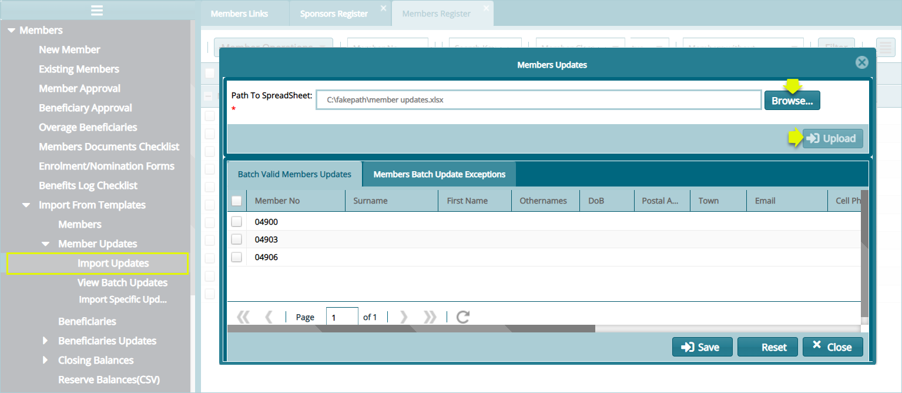

### Updating Members Register

In case there is need to modify members' details in the register, from the members' register window, select the members whose details need to be edited.

Click the icon on the far upper-right corner of the window to open a drop-down list and click the **Export selected members for update** link. This will load another window where you can download the template. After editing the details, upload back the template file to commit the changes. Refer to the screenshot below:

 

Clicking the link as shown above will open a new window allowing one to download the members register in an excel template as shown below:

 

After downloading and updating the member details in the template appropriately, upload the template to the system to save the changes in the register. The following screenshot shows a window with a successful update process:

 