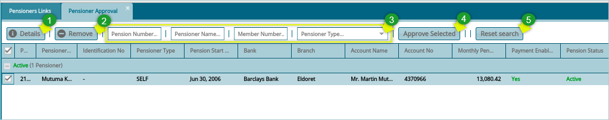

## **Pensioners Approval**
After uploading pensioners successfully, as show in the previous screenshot, the pensioners must be approved before they can be listed in the pensioners register.

To approve uploaded pensioners, click the **Pensioners Approval** link to load a window with a grid table showing all uploaded pensioners ready for approval as shown in the screenshot below:

 

From the pensioners approval window, select a pensioner from the grid table and take a number of actions as shown below: 

 

**Action**

- Click **Label 1** button to view the details of a selected pensioner in a different window. 
- Click **Label 2** button to remove a pensioner from the approval list.
- Click **Label 3** and type to search pensioners by pensioners number etc. to filter the records.
- Click **Label 4** button to approve a selected pensioner from the list.
- Click **Label 5** button to reset the search fields.

**Note:** when a selected pensioner is approved by clicking the **Approve Selected** button, as shown previously, the pensioner will be moved to the **Pensioners Register** as shown below:

 

