## **Pensioner Deduction**
These are different forms of deductions that are to be made from pensioners moneys to remit to other funds such as medical covers or saccos.

### **Prerequisites**
- Deduction types should be added to the system
- Deduction type bank details should be up to date

### **Medical Cover Deductions**
To view a list of medical cover contracts, from the Deductions menu, click the Cover Contract link as shown below to open the cover contracts window. See the screenshot below:

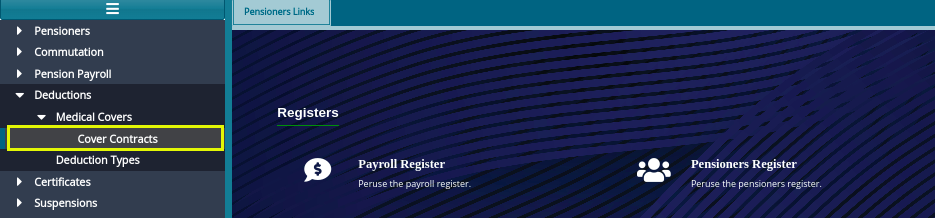 

Clicking the Cover Contracts link will open the cover contracts window with a grid table showing a list of medical covers already created in the system. A new cover can be created and deleted as shown in the screenshot below:

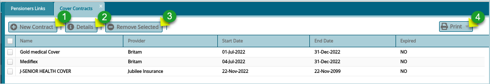 

**Action**

- Click **Label 1** button to add a new medical contract.
- Click **label 2** button to view the details of a selected contract.
- Click **label 3** button** to remove a selected contract from the list.

Clicking the **New Contract** button will open a Premium Cover Contract details dialog box through which the details of a new contract can be added in the system as shown in the screenshot below: 

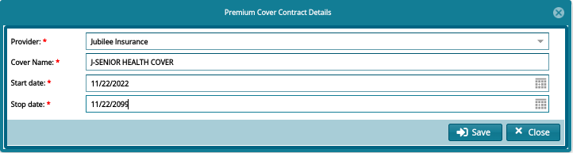 
### **Deduction Types**
Deductions denote amounts of money deducted from pensioners accounts for remitting to other funds such as saccos. The system allows adding of new deductions to the system.

To add Deduction Type to the system, navigate to deduction menu and click **Deduction Types link** as shown below: 

 

Clicking the Deduction Type link will open the Deduction Types window which comes with a grid table showing a list of deduction types already created in the system. A new deduction can be created and deleted as shown in the screenshot below:

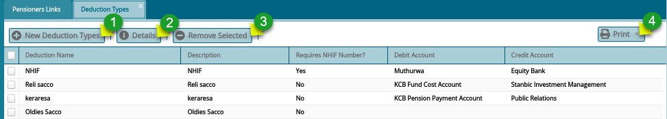 

**Action**

- Click **Label 1** button to add a new deduction.
- Click **label 2** button to view the details of a selected deduction type.
- Click **label 3** button** to remove a selected deduction type from the list.

Clicking the **New Deduction Type** button will open a Deduction Types dialog box through which the details of a new deduction type can be added in the system as shown in the screenshot below: 

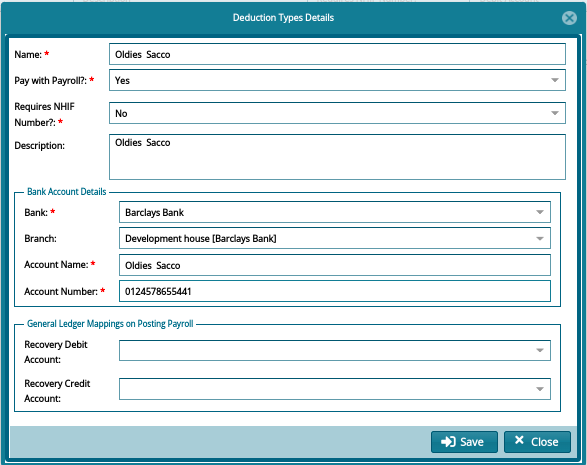 

### **Adding Deduction to Pensioner**
Once the details have been saved successfully the next action is to add Pensioners deduction. There are two methods for adding deductions to pensioners:

1. Adding deduction for a single pensioner
1. Adding deductions via template for more than one pensioner

### **Adding Deduction for a Single Pensioner**
To add single pensioner deduction, proceed to the left side panel and click payroll register link as shown below: 

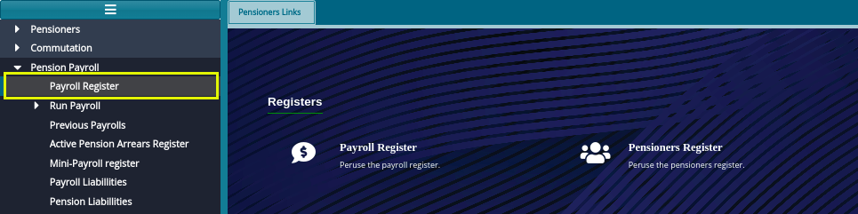 

Clicking the Payroll Register link will open the Payroll Register window with a grid table showing all pensioners who are eligible for any pay once the payroll has been validated and processed. To add deduction for a single pensioner, select a pensioner from the list and click show details button (it turns to hide details when clicked) on the right upper corner. This will open a section on the lower part of the window. Locate the Add Member deduction on the left side and click to launch a dialog box for filling in details. See the screenshot below:

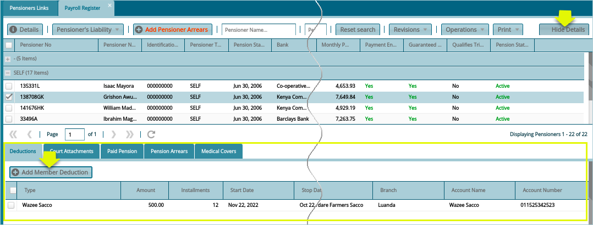 

Clicking the **Add Member Deduction** button will pop up a pensioner deduction form through which details of the deduction transaction are captured as shown below: 

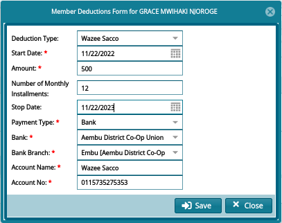 

### **Adding Pensioner Deductions through Template**
This applies when the user wants to add pensioner deductions for more than one pensioner which will save user’s time as opposed to adding deductions for a single pensioner at a time.

### **Prerequisites**
- Load the deduction template provided.
- Deduction type code specified in the template should be existing within the system if not it should be added.

To upload a deduction, navigate to the pensioners register as demonstrated previously with a single pensioner. From the menu bar click the Pensioner Liability and from the drop-down menu, select **Import Member Deductions** as shown in the screenshot below:

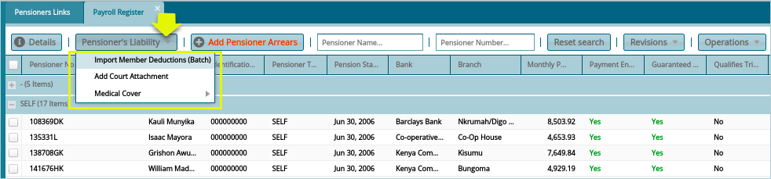 

Clicking the **Import Member Deductions** button will load an import deductions window. Click the **Browse** button and navigate to the location of already loaded deduction template from your files and click upload button which will populate the grid with both valid and invalid deduction details as shown in the screenshot below:

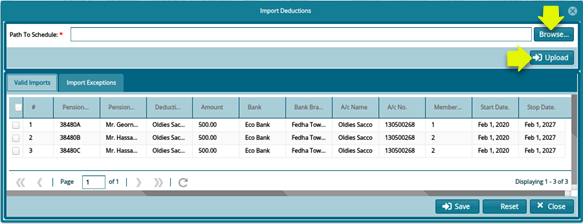 

To view Pensioner’s Deductions list, navigate to the Payroll Register menu and select a Pensioner from the list. Click the **Show Details** checkbox at the right top corner as shown in the screenshot below:

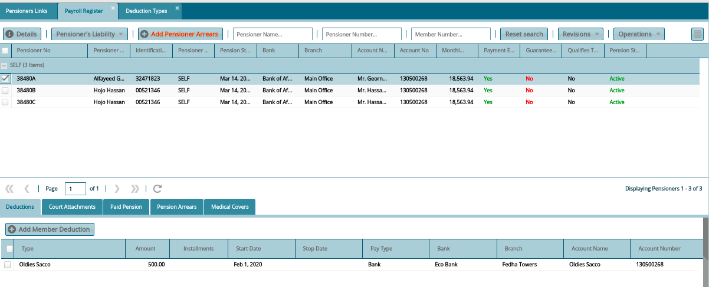 

## **Pension Arrears**
To add Pensioner Arrears, select pensioner to add arrears for in the payroll register. Click the **Add Arrears** button to open a **New Pensioners Arrears** form. Key in the arrears details and click the **Save** button as shown in the screenshot below:

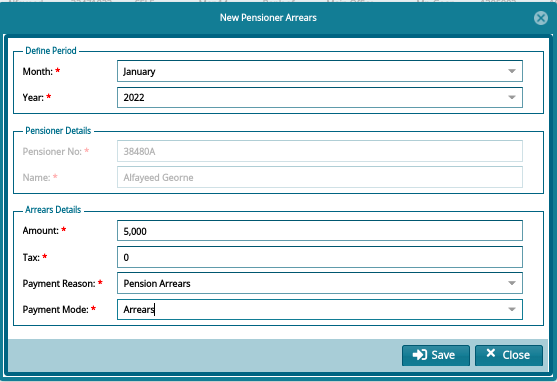 

To view Pensioner Arrears, navigate to Payroll Register and check Show Details menu to load a new section on the lower section of the window where the arrear transactions are listed in a grid table as shown below:

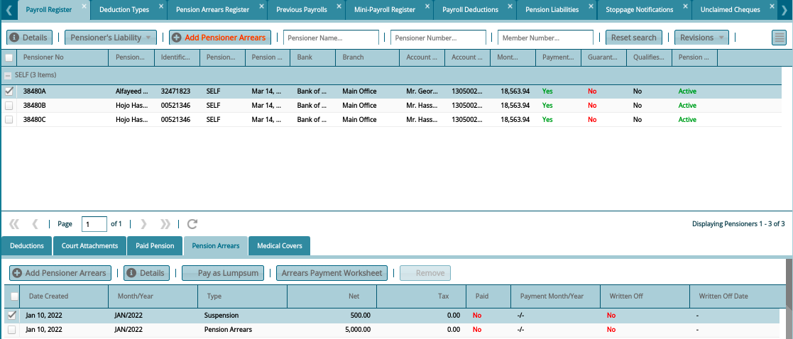 