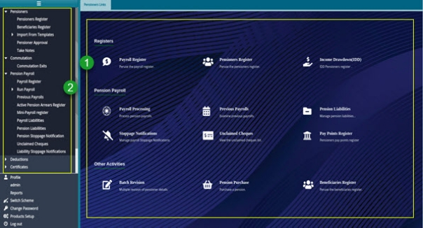

## **Pensioners Module**
The Pensioners Module enables the registration of pensioners through templates into FundMaster. The Pensioners are connected to the members register through member numbers. Furthermore, the module allows viewing of pensioners' registers at different status i.e., Active, Suspended, Deferred. It enables onboarding of new pensioners, initiating death in retirement process, running certificate of existence, running payroll, adding deductions among other activities as will be demonstrated in this chapter.

To access the Pensioners Module dashboard, click the Pensioners Module hot link on the FundMaster landing page to open the **Pensioners Links** window shown below:

 

**Action**

- Click the hot links under the section **labelled 1** to access shortcut routes to commonly visited links in the pensioners module.
- Click the menu item links listed on the left side panel in the section **labelled 2** to access pensioners forms, registers and configure all pensioners-related settings.

**Tips**

- All the links under **label 1** can still be accessed on the left side panel although some are tacked under sub menus.