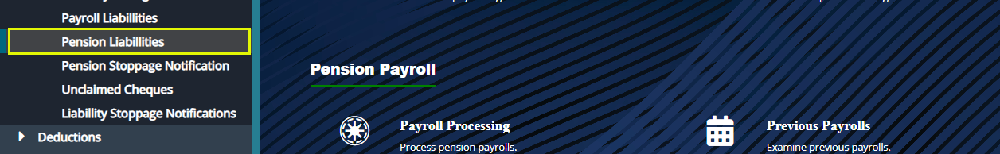
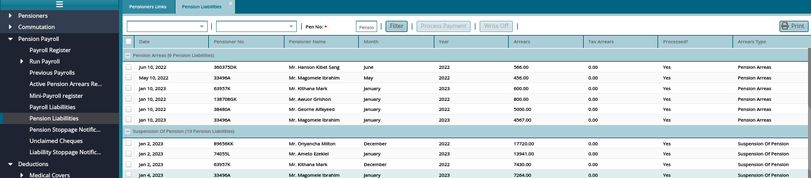

### **Pension Liabilities**
Pension liabilities refers to pension payments obligation that has not been received by due dates e.g., pension arrears.

To view pension liabilities, navigate to the Pension Payroll menu and click the **Pension Liabilities** link as shown below:

Clicking the Pension Liabilities link will open the Pension Liabilities window with a grid Table listing all the liabilities in different categories as shown in the screenshot below:

