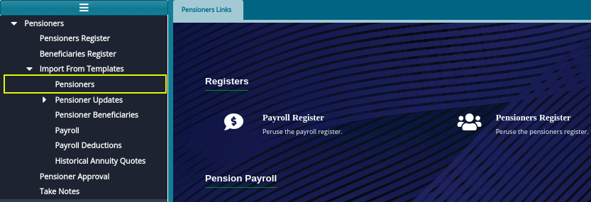
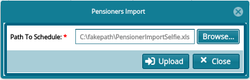

## **Pensioners Onboarding Via Templates**
### **Prerequisites**
To onboard pensioners, a user must load the pensioners and upload template details with verified pension details including:

- **Member No**: Member number acts as a connection between the pensioners register and the member register.
- **Pension status**: The status of pension, which could be either active, deferred, suspended e.tc
- **Pensioner Number**: This is the unique identity number for a pensioner.
- Other details are well described in the template provided.

To upload the pensioners in bulk using a template, click **Pensioners** link from the **Import From Template** menu as shown below: 

 

Clicking the **Pensioners** link will load an upload the pensioners batch details window through which pensioners are loaded into the system as shown below:

 

Click the **Browse** button and navigate to the location of the template in your files and click the **Upload** button which will populate pensioners data in a grid table with valid and invalid (Exceptions) pensioners data as shown below:

 

Once the user has uploaded the pensioners through template the next action is to approve uploaded pensioners.