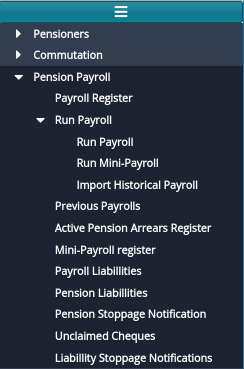

## **Pension Payroll**
FundMaster Pension Payroll is designed in such a way that a user can verify, validate, and push the payroll for payment processing. FundMaster payroll has the capability of performing the following functions automatically:

1. Receipt of pension payroll records e.g., eligible pensioners.
1. Gross pay calculation.
1. Calculation of pensioner’s deductions, taxes and subtracting them from gross pay.
1. Calculation of arrears to eligible pensioners which are computed automatically and paid in the next payroll or as a lump sum.
1. Recoveries of liabilities from monthly pension.

### **Prerequisites**
- Pensioners bank details should be up to date.
- All pensioners' Tax pins should be up to date or set as non-mandatory in the account’s configuration setup.
- All deductions if any have been added.

Prior to running pension payroll, the system runs validation checks to identify gaps that might cause balancing issues.

### **Running Pensioners Payroll**
To run the payroll, navigate to Pension Payroll menu, from the Run Payroll menu, click on Run Payroll sub-menu to pop up a payroll checklist as shown in the screenshot below:

 

Clicking the **Run Payroll** link on the sub-menu will open Payroll Roll checklist window as shown in the screenshot below:

 

Once all the checkboxes have been checked and there are no exceptions, clicking the **Run Payroll** button will open a date and month confirmation dialog box. Click the Run Payroll button as shown below:

 

Clicking the Run Payroll button will run the run the payroll. If the payroll rans successfully, a dialog box will pop up for confirmation. Next, procced to the top menu bar to **Validate**, **Confirm**, **Authorize** and **Post** to accounts.
### **Previous Payrolls**
To view all the payrolls that have already been ran for different months, navigate to pension payroll menu and click the **Previous Payrolls** link as shown in the following screenshot:

 

Clicking the **Previous Payrolls** link will open the Previous Payroll window with a grid table listing all previous payrolls as shown below: 

 

**NB:** Select payroll month and year to view pensioner’s payroll details, else the grid will be empty.

### **Pension Arrears Register**
 

### **Payroll Confirmation and Posting**
At this stage the payroll is confirmed against the staged payroll in FundMaster. To confirm payroll, navigate to the **Payroll Operations** menu and from the drop-down menu, click **Confirm Against Staged Payroll** link (otherwise click the **Reverse Payment** link) to confirm the transaction as shown in the screenshot below:

 

### **Mini Payroll**
Mini payroll is a subset of pensioners payroll which is specifically used to process pensioners unpaid arrears only; instead of paying arrears to pensioners from the payroll. 

To run the mini-payroll, navigate to the Run Payroll sub menu and click **Run Mini-Payroll** link to start running mini payroll as shown in the screenshot below:

 

Clicking the **Run Mini-Payroll** link will open a confirm dialog box to confirm that you want to run the mini-payroll. Click **Yes** button to run or the **No** button to decline as shown in the screenshot below: 

 

Clicking the **Yes** button, as shown previously, will get the mini payroll running. Once the mini-payroll has ran successfully, a dialog box will pop up indicating that the mini-payroll has ran successfully. See screenshot below: 

 

To view a list of the previous mini-payrolls that has been ran successfully, navigate to the Pension Payroll menu and click **Mini-Payroll register** as shown below: 

 

Clicking the **Mini-Payroll Register** link, as shown previously, will load the Mini Payroll Register window where a grid table containing mini-payrolls that have been ran successfully (the Mini-Payrolls are grouped by the arrears per month) is displayed as shown in the screenshot below:

 

- To certify the arrears, select the arrears for the specific month and click at the certification drop down button at the top.
- To post the arrears to accounts select the arrears for a specific month and click on the posting drop-down button at the top.
- To view the list of pensioners arrears for specific month, select the arrears moth from the grid and click on the show details button at the top right corner which will load another grid at the button of the main grid as shown in the illustration below:

 