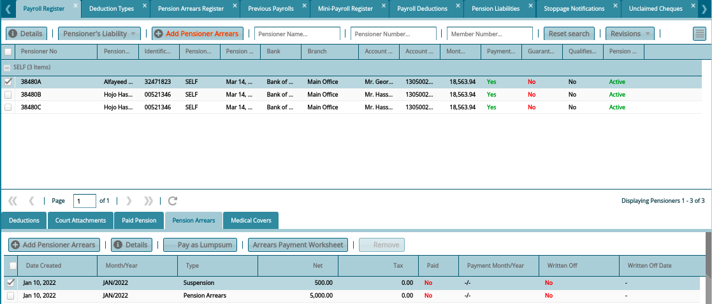

### Pensioner Arrears

To add Pensioner Arrears, select pensioner to add arrears for in the payroll register. Click the **Add Arrears** button to open a **New Pensioners Arrears** form. Key in the arrears details and click the **Save** button as shown in the screenshot below:

 

To view Pensioner Arrears, navigate to Payroll Register and check Show Details menu to load a new section on the lower section of the window where the arrear transactions are listed in a grid table as shown below:

 