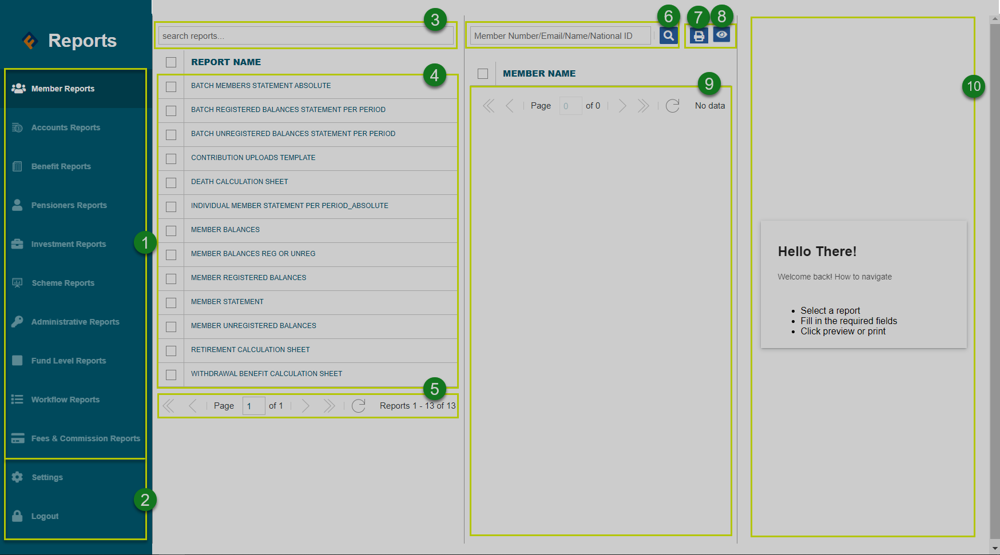

### Dashboard Components

The following screenshot shows the member dashboard that consists of a menu bar on the left side and main sections with summarized information.

 

The numbered sections in this screenshot above correspond to the numbers in the following table that describe the key components of the Reports module dashboard.

| **No.** 	| **Part**            	| **Description**                                                                                                                                           	|
| :---------	| :-----------------------------	|:-----------------------------------------------------------------------------------------------------------------------------------------------------------	|
| 1.  	| Reports Menu      | This is the menu from which various module-based reports are accessed by clicking the menu items.                                        	|
| 2.    	| Settings & logout buttons      | The settings button will open a dialog box for configuring reports data source access type. The logout button will terminate the session when clicked.                                     	|
| 3.    	| Reports search box       | Used for looking for a particular report quickly using keywords.                                                                                                    	|
| 4.  	| Reports list     | This section of the window generates a list of all the reports under a selected category on the left side panel.                                                                  	|
| 5.    	| Reports pagination      | This shows the number of report available under a selected category thus aiding in navigation.                                                                                                  	|
| 6. 	   | Member search box     | Used for searching for a particular member report details.                                                                                                                 	|
| 7.    	| Report print button     | The print button will open a new window where a selected report is generated ready for printing.                                                                                                                 |
| 8.  	| The preview button     | will load a copy of the printable report on the preview window.    	|
| 9.     | Members list      | This section of the window generates a list of all members under a selected category of reports.                                                                                                         	|
| 10.    | Report preview window      | This section will load the report for reviewing before it can be printed.        
                                                                               	|