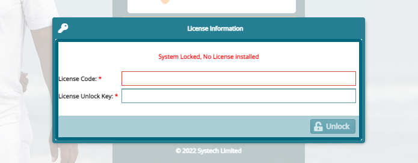

### **FUNDMASTER APPLICATION DEPLOYMENT GUIDE**

### **1. Introduction**

The guide details the prior requirements and deployment process for FundMaster Xe (and its peripherals - Member Self-Service portal (MSS) and Unstructured Supplementary Service Data (USSD)) on servers. If executed correctly, the instructions herein will lead to successful installation of FundMaster on the oracle database.

Please follow this link: <https://systechafrica.github.io/#/> to access the System documentation and read more on the FundMaster core system.

### **2. Software Prerequisites**

Before deploying FundMaster and its peripherals, the system requirements must be met:
-   For Server required specification, refer to the [server and software requirements (on premise and on clouds
    hosting)bdocument](https://docs.google.com/document/d/1zGpBqDdy2Hp2P5gWXAyh2H0yGtdGg-DRjNpU3shHUPo/edit)
    for the detailed requisite environment specification.
-   Note that FundMaster supports all types of base Operating Systems including Windows, Linux, and macOS. But in this document, we have used Linux as the base OS.

### **3. Deployment expertise**

For successful deployment of the system and running of all server-side operations, the personnel ought to have the following minimum qualifications:

-   Qualified System Admins.

-   Proven mastery of Linux command line.

-   Qualified Database Administrators.
  

### **FUNDMASTER XE ON ORACLE**

To set up FundMaster Xe on the Oracle database, follow the steps below:

### **i.  Install jdk preferred version and Maven**

As at the date of writing this guide, the most stable version to run Xe is jdk 11.

To install JDK on Linux, visit the [oracle official website](https://www.oracle.com/java/technologies/downloads/) and download jdk 11. The downloaded zipped file must in a specified directory and pointed to the right path, as demonstrated in the following link: [Step-by-step installation of Java on RPM based Linux system.](https://docs.oracle.com/en/java/javase/11/install/installation-jdk-linux-platforms.html)

To install Maven on Linux/Unix, visit the [Apache Maven official website](https://maven.apache.org/) and download the latest version of Maven binary tar.gz file. Extract the archive to the folder you want to use Maven in.

Open the terminal and run the following commands to set the environment variables; for example, if *apache-maven-3.3.9-bin.tar.gz* file was downloaded, the commands would be:

````java
export M2_HOME=/usr/local/apache-maven/apache-maven-3.3.9

export M2=＄M2_HOME/bin

export MAVEN_OPTS=-Xms256m -Xmx512m

export PATH=＄M2:＄PATH
````

### **ii. Install intellij Ultimate**
After a successful installation of Java, see previous step, visit [jetbrain.com](https://www.jetbrains.com/help/idea/installation-guide.html#98d0a3d8) to learn how to install ultimate version. Note that this version of intellij is premium, and therefore the activation key is needed. Contact your administrator for more details.


### **iii. Install Oracle database**
There are many resources online that can help in the installation of Oracle databases. This guide is for Linux/Mac users, although there are similarities with Windows users. The article [Install Oracle 19C on Centos8](https://www.centlinux.com/2020/04/install-oracle-database-19c-on-centos-8.html) provides clear step-by-step instructions on how to install oracle successfully.

### **iv. Install & Configure wildfly**

> ``` To be filled by John Oenga ```

### **v. Clone Backend (Xe) and Frontend(extjs)**

Go to your working directory and clone xe and extjs:

> git clone ``` \<xe-repository url\> ```

> git clone ``` \<xe-url\> ```


### **vi. Install Sencha and configure Extjs**
Visit Sencha support official site (provide link) and login with Systech's provided details.

Download Sencha CMD and extjs framework. As at the time of writing this document, Xe uses SenchaCMD-7.6.0 and extjs-7.5.1. Assuming you are on Linux, unzip the Sencha CMD and run the resulting installer script. Follow the setup wizard to install sencha.

Type sencha command, to see an output starting with "Sencha....". If however you get "command not found" error, take the installation path,and add to \$PATH manually:

```SQL

Open .bashrc file using vim/vi/gedit

Add the following line at the end of the file:

export PATH=\"/home/\<your user\>/bin/Sencha/Cmd:\$PATH\"

Refresh the file the command: source .bashrc

Unzip the ext-framework (in our case ext-7.5.1) to a directory cd to your cloned extjs project you want to build and run the following command:

sencha app install \<the path to your ext framework\> Done. You can now build your project. Run the following command:
```

### **Deploy FundMaster**

```SQL
cd to your xe project

Run:

cd \<your-wildfly\>/bin

sh standalone.sh (starts the wildfly app server)

cd /\<your-xe-project\>

mvn clean compile package wildfly:deploy; or

cp xe/target/Xe.war /\<your-wildfly\>/standalone/deployments

**NB:** To compile Ext-7, run the following steps in building, then redeploying the application

cd \<Your-ext-project\>

sencha app build production 

cd to /your-extjs-project/build/production/\<your project\> 

copy all the contents in the folder to the java backend. For example, in the case of xe, 

copy all the extjs content to \<your project\>/src/main/webapp.

Note: Remove all the previous contents from the web app except the WEB-INF/ folder.

Build the xe/ project using the command:

    mvn clean compile package

cd to the xe/target folder and run this command to deploy your application:

    cp xe/target/Xe.war /\<your-wildfly\>/standalone/deployments
```


### **FUNDMASTER XE ON POSTGRES**

To set up FundMaster Xe on POSTGRES, follow the steps highlighted in the code snippet below:

```java
\`\`\`\`bash

  #Install Postgres  version \>= 12.6

  psql -V  #confirm version installed

\`\`\`\`

\`\`\`\`bash

    # Find newest guide on postgres official site**

    sudo dnf install -y
https://download.postgresql.org/pub/repos/yum/reporpms/F-37-x86_64/pgdg-fedora-repo-latest.noarch.rpm**

    sudo dnf install -y postgresql15-server

    sudo /usr/pgsql-15/bin/postgresql-15-setup initdb

    sudo systemctl enable postgresql-15

    sudo systemctl start postgresql-15

\`\`\`\`

\`\`\`\`blockquote

    Now cd /var/lib/pgsql/15/data/

**    edit pg_hba.conf**

**    from  **

**    local   all             all                                    
peer**

**    host    all             all             0.0.0.0/0                
  scram-sha-256**

**    To**

**    local   all             all                                    
trust**

**    host    all             all             0.0.0.0/0                
  trust**

 postgresql.conf

    Find and uncomment line #listen_addresses = \'localhost\' and edit
to

       listen_addresses = \'\*\'

       Uncomment also:

       #port = 5432

       #password_encryption = scram-sha-256     \# scram-sha-256 or
md5

    Exit from root and restart the service:

    sudo systemctl restart postgresql-15.service


    Login to postgres**

    psql -U postgres**

    run command:**

    alter user postgres with password \'YOURPASSWORD\';**

    Exit from postgres session.**

   **

    Now cd /var/lib/pgsql/15/data/**

    edit pg_hba.comf**

    from**

    local   all             all                                    
trust**

**    host    all             all             0.0.0.0/0                
  trust**

**    To**

**    local   all             all                                    
scram-sha-256**

**    host    all             all             0.0.0.0/0                
  scram-sha-256**

**   **

**    Exit from root and restart the service:**

**    sudo systemctl restart postgresql-15.service**

**   **

**    login to postgres using \'YOURPASSWORD\'**

**\`\`\`\`**

**\## Install Wildfly**

**\`\`\`\`**

**Install Wildfly  version \>= 18.0 Final**

**\`\`\`\`**

**\## Configure Datasource & Setup Driver**

**\`\`\`\`xml**

** \<datasource jndi-name=\"java:jboss/datasources/PostgresXe\"
pool-name=\"PostgresXe\" enabled=\"true\" use-java-context=\"true\"\>**

**                    \<connection-url\>jdbc:postgresql://localhost:5432/fm\</connection-url\>**

**                    \<driver\>postgresql\</driver\>**

**                    \<security\>**

**                        \<user-name\>postgres\</user-name\>**

**                        \<password\>postgres\</password\>**

**                    \</security\>**

**                \</datasource\>**

**\`\`\`\`**

**\#### NB: Replace above with your database name and connection credentials. Use \[fm\] as database name for smooth run**

**\## Run or deploy Xe**

**\`\`\`\`bash**

**git checkout xe-postgres**

**mvn clean compile wildfly:deploy**

**\`\`\`\`**

**\## Confirm Creation of Tables**

**\`\`\`\`bash**

** psql -U your_postgres_user**

** #Enter Your password**

** \\l #show databases**

** \\c your_db #switch to db**

** \\dt #show tables**

** \\q #Quit**

**\`\`\`\`**

**Create this tables**

**\`\`\`SQL**

**create domain clob as text;**

**create table USERS_SCHEMES**

**(**

**    USERS_ID          bigint not null**

**        constraint FKI664IMXO4SPEB8J43W9RUKF1S**

**            references USERS,**

**    ALLOWEDSCHEMES_ID bigint not null**

**        constraint FKMQV6UDXD3PCOR5T8U6X8DBNX2**

**            references SCHEMES**

**);**

**create table USERS_MEMBER_CLASSES**

**(**

**    USERS_ID**

**        bigint**

**        not**

**            null**

**        constraint**

**            FK9TGKRTT6A6RH2FHRHBQU0EX0V**

**            references**

**                USERS,**

**    MEMBERCLASSES_ID**

**        bigint**

**        not**

**            null**

**        constraint**

**            FKM6XCAGUW6K14CQ9BHUG1DNOPV**

**            references**

**                MEMBER_CLASSES**

**);**

**create table USERS_SPONSORS**

**(**

**    USERS_ID**

**        bigint**

**        not**

**            null**

**        constraint**

**            FKT3JSM9FJL7S6UWOMIO41YD0BV**

**            references**

**                USERS,**

**    ALLOWEDSPONSORS_ID**

**        bigint**

**        not**

**            null**

**        constraint**

**            FKK7GMGB78K7MSQ912GKO8UIBVU**

**            references**

**                SPONSORS**

**);**

**\`\`\`**

**\## Import functions and procedures and Views**

**\`\`\`\`bash**

**\# locate routines_64.sql and views_349.sql in
../resources/pg_scripts/ in project folder**

** psql -U your_postgres_user**

** # Enter Your password**

** \\l \# show databases**

** # You may require to run this next two steps severally to ensure all
views and routines are created**

** \\c your_db \# switch to db**

** \\i path_to_routines_64.sql \# import routines, repeat until no
errors**

** \\i path_to_views_349.sql \# import views,  repeat till no errors**

** \\df #confirm routines**

** \\dv #confirm views**

** \\q \# Quit**

**\`\`\`\`**

```

All set, now continue the normal setup of Xe.


### **4. Runtime Maintenance**

**Software Release & Versioning**

Systech Ltd rolls out FundMaster software upgrades in versions periodically. At the time of publishing this guide, the latest and LTS support version was Xe.

FundMaster upgrades and releases are done every month. This process is done after **code reviews** and **testing** (all types of tests) has been done. We use version control to keep track of various releases. Every release has a release tag and notes/documentation. We also make maximum use of docker in doing the deployments.

Upgrades are based on:

-   What has been fixed?

-   What has improved?

-   What has been deprecated?

Various upgrades have release tags or versions that help to give meaningful releases, since each feature/release is a combination of commits to be grouped under a release tag.

The versioning type that we used in semantic versioning. Semantic versioning works by structuring each version identifier into three parts, **MAJOR**, **MINOR,** and **PATCH**, and then putting these together using the familiar "MAJOR, MINOR, PATCH\'\' notation. Each of these parts is managed as a number and increment according to the following rules:

-   **PATCH** is incremented for bug fixes or other changes that do not change the behaviour of the software (Backward compatible bug fix).

-   **MINOR** is incremented for backward-compatible changes of the software, meaning that existing consumers can safely ignore such a version change (Backward compatible new features).

-   **MAJOR** is incremented for breaking changes, i.e., for changes that are not within the backward compatibility scope. Existing consumers must adapt to the new software.

Most of these changes are client-driven and some are invented by the technical team.

**Licensing**

There is a feature on FundMaster where you can view the remaining number of days before the system license expires and request for a new one. See the screenshot below:

 


**Note** Once the license expires, you should get the below error requiring you to get a new License.

 