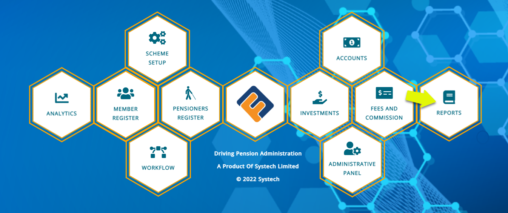
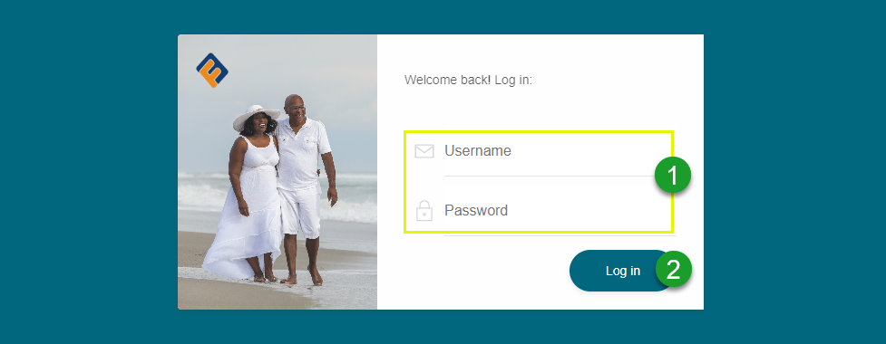

### Getting started

To access the reports module, click the **Reports** hot link icon on the main dashboard as shown in the screenshot below: 

 

**Login process**

After clicking the Reports link, as shown in the previous screenshot, the user is directed to the login page where one is supposed to enter login credentials for authentication.

 

**Action**

- Type Username and Password respectively in text boxes **labelled 1**.
- Click Log in button **labelled 2** to get access into the report’s module dashboard. 

