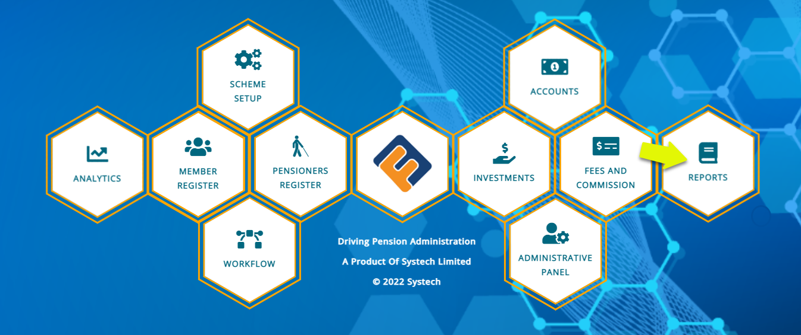
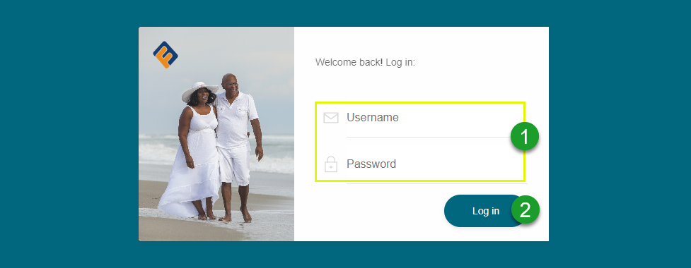

### Introduction

The reports module provides a separate interface for accessing every report generated across all modules in FundMaster by aggregating the reports under one dashboard. The aim is to ensure quick, easy one-stop exclusive accessibility to system users. Technically, this also enables deployment of reports on another instance of server thus reducing the amount of stress on the main application, making it more efficient. 

### Getting started

To access the reports module, click the **Reports** hot link icon on the main dashboard as shown in the screenshot below: 

 

### Login process

After clicking the Reports link, as shown in the previous screenshot, the user is directed to the login page where one is supposed to enter login credentials for authentication as shown in the screenshot below:

 

**Action**

- Type Username and Password respectively in text boxes **labelled 1**.
- Click Log in button **labelled 2** to get access into the report’s module dashboard. 