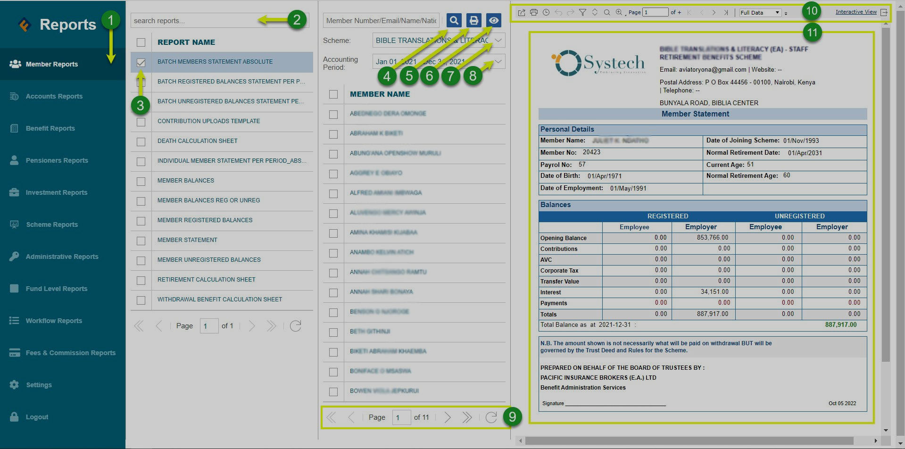
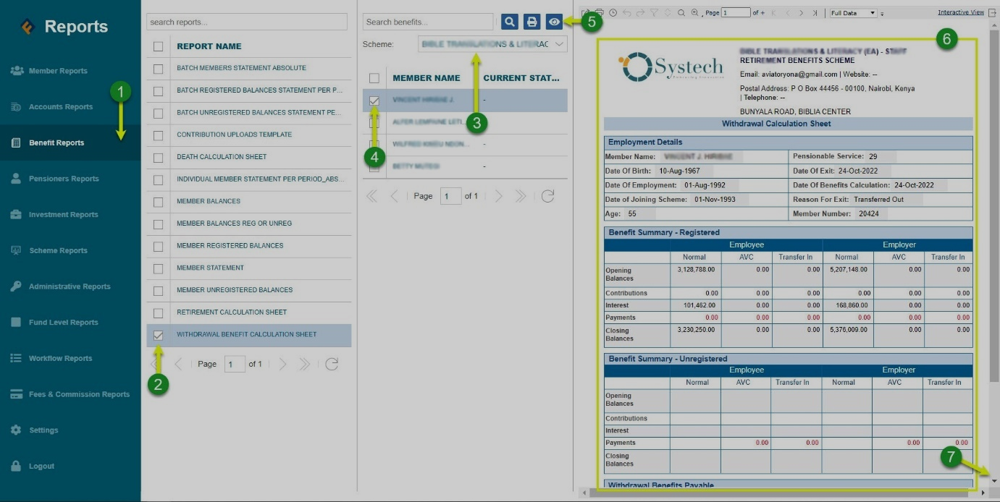

### How to Access Reports 

Accessing a particular report on the dashboard will require step-by-step actions to be executed correctly. The following is a demonstration showing how to successfully access sample reports.

## Members Statement Report

To generate members statement report for all members (a batch) in a scheme, follow the steps highlighted in the sample screenshot below:

 

**Action**

-  Click **label 1** button to select type of report from the report’s menu.
  
-  Click **label 2** text box and type the name of the report to retrieve it from a list of members related reports.
  
- Click **label 3**  button to select a particular report from the list.

- Click **label 4** button to select a member quickly in case you want to generate a report for one member.
  
- Click **label 5** button to open a new window tab from which a printable copy of the report is generated ready for printing.
  
- Click **label 6** button to preview a copy of the report on the right side of the window.
  
- Click **label 7** button to select a particular scheme from a list of schemes.
  
- Click **label 8** button to select the accounting period to generate statements for.
  
- Click **label 9** menu to navigate through other report pages.
  
- Click **label 10** menu to navigate through the individual member statements report.
  
- The window section **label 11** displays an individual’s member statement. Use the pagination under label 10 to see other members statements. 

## Members Benefit Report

To generate a member's withdrawal benefits calculation sheet report, follow the steps highlighted in the sample screenshot below:

 

**Action**

-  Click **label 1** button to select benefit report from the report’s menu.
  
-  Click **label 2** checkbox to select the withdrawal benefits calculation sheet.
  
-  Click **label 3** to select a scheme from the text box drop-down menu.
  
-  Click **label 4** check box to select a particular member to generate the report for.
  
-  Click **label 5** button to preview a copy of the report on the right side of the window as shown above.
  
-  The window section **Labelled 6** is a section showing a preview of the generated report. 
  
-  Click **label 7** button to scroll down and see the entire report.