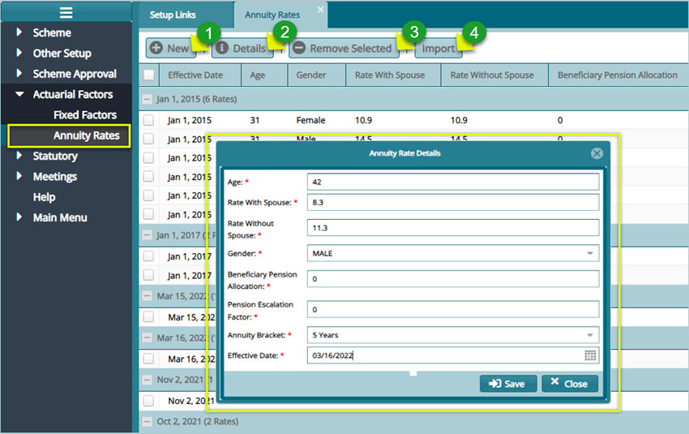

## Actuarial settings

Actuarial set of configurations aids in setting up actuarial factors that are used in DB and DC lump sum calculations. Click the links shown in the screenshot below to set fixed factors and annuity rates.

Click on the links under the drop-down submenu as shown in the screenshot below to set fixed factors and annuity rates.

  

### Fixed Factors

Fixed factors are provided by the scheme actuaries and aid in the calculation of pension for DB and DC member benefits based on the retirement age and the gender type.

Click the **Fixed Factors** link to open the fixed factors window to view a list of set factors and to create new factors as shown below:

 

**Action**

- Click **label 1** button to create a new fixed factor.
  
- Click **label 2** button to view the details of a selected factor from the list.
  
- Click **label 3** button to upload already prepared factors in a template.
  
- Click **label 4** button to remove a selected factor from the list.

### Annuity Rates

Annuity rates are provided by the third-party insurance companies with the help of internal or external actuaries to aid in the calculation of pension purchase prices or annuities purchase.

Click the **Annuity Rates** link to open the Annuity Rates window and set **New Rates** as shown below:

  

**Action**

- Click **label 1** button to create a new annuity rate.

- Click **label 2** button to view the details of a selected annuity rate from the list.
  
- Click **label 3** button to remove a selected factor from the list.
  
- Click **label 4** button to upload already prepared annuity rates in a template.
