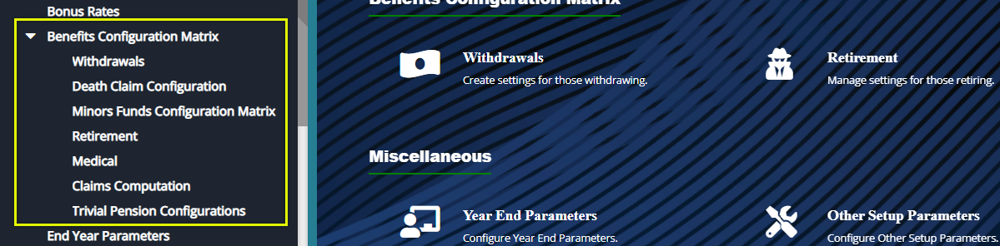
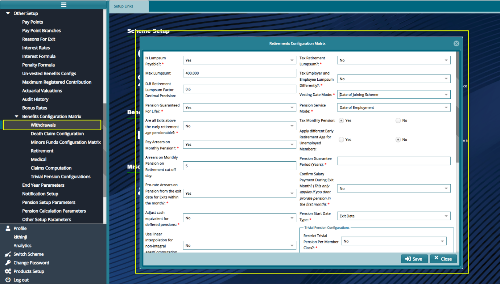

## Benefits Configuration Matrix 

The Benefits Configuration Matrix is a tool that aids in setting the laid down rules or procedures in the trust deed and rules regarding each of the item in the drop-down submenu as shown in the screenshot below:

  

## Withdrawals

Click the **Withdrawals** link to open a Withdrawal Configurations Matrix dialog box as shown below:

**Parameter Description**

-   **Hold Employer Benefits until Retirement?** Refers to whether the employer contributions will be held till the withdrawing member attains the retirement age to access the employer portion.

-   **Effective date for the above:** refers to when the above condition was passed into law. For example, the employer benefits portion can only be accessed at retirement age condition was signed into law by the on 30 June 2005.

-   **Pay Employer Benefits:** whether employer benefit will be paid.

-   **Defer Unregistered Employer benefits:** Explains whether the employer benefits portion being deferred will affect the unregistered benefits if the withdrawing member will be paid the unregistered benefits currently or at attaining the retirement age.

-   **Linear Interpolation Mode:** this is a mathematical approach where we use to subsequent values to find out the middle value between for example factors in ages; in ages 45 and 46 we can use factors based on days in a year or days in a month.

-   **Number of days in a year Mode**: refers to mathematical interpolation based on number of days in a year mode.

-   **Number of days in a month Mode:** refers to mathematical interpolation based on number of days in a month mode.

-   **Tax withdrawals:** states whether the members withdrawing is subject to taxation in regard to his age at withdrawing based on the trust deed and rules of the respective scheme.

-   **Tax Employer and Employee benefits differently?** state whether the employer and employee benefits are taxed differently. This is accordance to the trust deed and rules of the scheme in reference to the member’s age.

-   **Vesting Date mode:** Here the vesting formulas are used to determine the benefits the withdrawing member will be paid based on the years he or she has been in service. If the member is fully vested, he or she is entitled to
    the full vested amount but the employer portion is deferred until the member attains the retirement age.

-   **Allowed age for access of benefits:** This condition seeks to establish the date to which the vesting will be calculated from. You are supposed to specify whether it is the date of employment or date of joining scheme.

-   **Taxable period:** specifies the years of service period in which a member benefits are tax free or tax exempted. If a member withdrawal before this period, he or her benefits are taxed.

-   **Pension service Mode:** specify the initial start date for calculating a member’s service period.

-   **All withdrawal final salary based?** Specify whether the members’ benefits calculations are based on the final salary.

-   **Adjust cash equivalent for differed pension?** Specify whether to use the cash commutation factors for a withdrawal differed pension calculation

-   **Use Linear Interpolation for non-integral ages?** This is a mathematical approach where we use to factors for two subsequent integral values to find out the factor for a middle non-integral value regarding members’ ages. An
    example is illustrated below:

    *Interpolate the factor for an exit aged 55 years 5months, given the following factor table:*

| **Age** | **Factor** |
|---------|------------|
| 51      | 12.85      |
| 52      | 12.90      |

**= (12.85 + (5/12 \*0.1)) 12.89**

-   **Allow withdrawals in active service?** Specify whether the scheme trust deed and rules allow active member to withdraw from the scheme by checking the check box on this option.
  

## Death Claim Configuration Matrix

Clicking on the **Death Claim Configuration** link to open a Death Claim Configuration Matrix dialog box where a set of parameters informing death claims are set. See the parameters descriptions after the screenshot below: 

  

**Action**

-   Click **label 1** button to configure death in retirements parameters.

-   Click **label 2** button to configure death of beneficiary parameters.
  

**Parameter Description**

-   **Vesting Date Mode**: specify the initial start date for calculating a member’s full vesting period.

-   **Pension service Mode**: specify the initial start date for calculating a member’s service period.

-   **Add prospective service to pensionable service**? This condition seeks to establish whether the member’s beneficiaries will be paid benefits of the member’s years of service served until death or the full member benefits.

-   **Are beneficiaries Pensionable?** Specify whether the beneficiary will be entered in the pensioners’ payroll or they will just be paid the gratuity amount.

-   **If pensionable, is pension reduced?** Specify whether the beneficiary’s pension is reduced; a reduced pension refers to where a third of the pension is paid as lump sum and the two thirds are paid out as pension installments.

-   **Does beneficiary pension reduce over time?** Specify whether the beneficiaries pension reduces over time; a pension can be full rate years or reduced rate years.

-   **Full rate years:** This refers to the period in years a beneficiary is paid the actual pension amount.

-   **Reduced rate years:** This refers to the period in years after which the beneficiary’s actual pension amount is reduced. A reduced pension amount is arrived at through the use of reducing rate factors.

-   **Tax death in service benefits?** The death in service tax is done on any member benefits amount over Ksh 1.4 million.

-   **Refund contribution?** Specify whether the pension schemes refunds the employee contributions funds which are paid to the beneficiaries.

-   **Additional pension payable if deceased while on duty?** Specify whether there is any additional payable pension if the deceased passed on while on duty.

-   **Spouse pension guaranteed for life?** Specify whether the spouse pension is guaranteed for life.

-   **Child pension guaranteed for life**? Specify whether the beneficiary’s pension is guaranteed for life.

-   **Is death gratuity payable**: Gratuity is a multiple of a member’s salary, specify whether it is payable or not.

-   **Is Death gratuity is payable is it factor of the final salary?** Specify whether the gratuity payable is a factor of the final salary

-   **Qualified salary factor:** There is a limit to the years of service for a member to qualify for gratuity. There are also factors for gratuity based on the service periods. Qualified salary factor refers to the members who have
    qualified for gratuity.

-   **Unqualified salary factor:** this refers to the factors for the members who have not qualified for gratuity.

-   **Is death gratuity from scheme?** Specify whether the gratuity is being paid by the scheme. In some schemes, gratuity is paid by the sponsor or by the insurer for the insured schemes.

-   **Is maximum gratuity applicable?** Specify whether there is an applicable maximum gratuity.

-   **Maximum gratuity:** This is the maximum allowable gratuity amount. Any excess amount above goes to the pension portion.

-   **Period to qualify for full gratuity:** Specify the service period a member requires qualifying for full gratuity.

## Minors Funds Configurations

Click the **Minors Funds Configurations** link to open a Minors Funds Configurations dialog window and set the configurations as shown the screenshot below:

  

## Retirements

Click the **Retirements** link to open a Retirement Configuration Matrix dialog window and set the configurations as shown the screenshot below:

  

##  Medical

Click the **Medical** link to open a Medical Configuration Matrix dialog window and set the configurations as shown the screenshot below:

  

**Parameter Description**

- **Does member qualify for pension?** Specify whether the member qualifies for the pension on medical grounds in that he or she has been incapacitated to work.
  
- **If yes, is pension reduced or unreduced?** Specify whether the pension will be paid as a lump sum followed with pension installments.
  
- **Additional benefits provided if impaired while on duty?** Specify if there are any additional benefits if the member was impaired in the line of duty.
  
- **Tax medical lump sum?** Specify whether the medical lump sum is subject to taxation.
  
- **Pension service Mode:** specify the initial start date for calculating a member’s service period.
  

## Claims Computation

Click the **Claims Computation** link to load the dialogue box through which the settings are configured as shown below:

  

**Tip**

- The parameters here are set to determine how the scheme’s claim processes are handled by the system. 

## Trivial Pension Configurations

The trivial pension is the minimum pension amount that can be paid to a scheme member.

Click the **Trivial Pension Configurations** link to open a Trivial Pensions Configurations dialog window and set the configurations as shown the screenshot below:

  