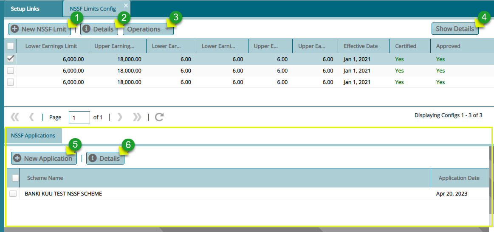

### Configurations

These are some of the key configurations that need to be set for the scheme to execute effectively. Click the drop-down submenu enclosed links to open configuration dialog boxes as shown below:

  

## Scheme Configurations

Click the **Scheme Configurations** link to open the scheme configurations dialog box and set the required parameters for different sets of configurations such as member configurations as shown below:

  

**Action**

-   Click **label 1** tab to load the **Members Configurations** window for set the appropriate parameters.

-   Click **label 2** tab to load the **Contributions and Balances Configurations** window for set the appropriate parameters.

-   Click **label 3** tab to load the **Claims and Pensioners Configurations** window for set the appropriate parameters.

-   Click **label 4** tab to load the **Scheme Dates and Insurance Covers Configurations** window for set the appropriate parameters.
  

## Global Configurations

Click the **Global Configurations** link to open a configurations dialog box and set the required parameters as shown below:

  

## Benefits Configurations

Click the **Benefits** **Configurations** link to open the scheme dates and insurance covers configurations dialog box and set the required parameters as shown below:

  

**Action**

-   Click **label 1** tab to load a window for setting Death Claim Configurations parameters.

-   Click **label 2** tab to load a window for setting Retirement Configurations parameters.

-   Click **label 3** tab to load a window for setting Trivial Pension Configurations parameters.

-   Click **label 4** tab to load a window for setting Medical Configurations parameters.

-   Click **label 5** tab to load a window for setting Claims Computation Configurations parameters.
  

## Contribution Configurations

This matrix addresses issues such as how to treat additional voluntary contributions by a member's employer, severance, and contribution underpayments.

To set parameters for these items, locate the **Contribution Configuration Matrix** link from the drop-down submenu as shown below:

  

Click this link to open the Contribution Configuration Matrix dialog box where the **Severance Due Entitlement** parameters are configured as shown below:

  

Click the **UnderPayments Threshold** tab to configure underpayments threshold details as shown below:

  

Click the **Social Security Configurations Matrix** tab to configure the social security contribution details as shown below:

  

## Max Registered Contribution

Click the **Max Registered Contribution** link to open the Maximum Registered Contribution window, then click the **New Max Registered Contribution** button to create a configuration as shown below:

  

**Tips**

-   This configuration is dependent on the country where the system is used. For instance, in Kenya, the salaried employees registered contribution amount is pegged at a maximum of KES. 20,000.

-   This means that any contribution above this amount is subjectable to tax. Click the highlighted link to access the window through which a new configuration can be done.
  

Click the **New Max Registered Contribution** button to load a dialog box through which a new configuration is set as shown below:

  

## NSSF Limits Configurations

Click the **NSSF Limits Config** link to open the NSSF Limits Confi window to view a grid table with limits configurations as shown below:

  

**Action**

-   Click **label 1** button to configure a new NSSF limit.

-   Click **label 2** button to view details of a selected Limit records from the list.

-   Click **label 3** drop-down Menu to certify and approve a selected NSSF limit configuration.

-   Click **label 4** button to load an NSSF Application window on the lower section of the window.

-   Click **label 5** button to create open a window to select a scheme to apply the limit on.

-   Click **label 6** button to view the details of a selected scheme from the applications window.

Clicking the **New NSSF Limit** button will open a dialog box. Fill in the details to create a new Limit shown below:

  

Clicking the **New Application** button will open a dialog box to select a scheme from the drop-down list and apply the NSSF limit configurations to as shown below:

  

**Note:** The scheme selected from the drop-down list will be configured in such a way that the members contributions in that scheme will be subjected to the selected NSSF limits.

