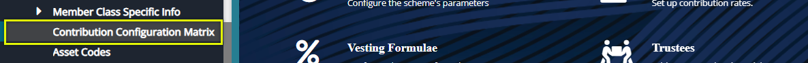
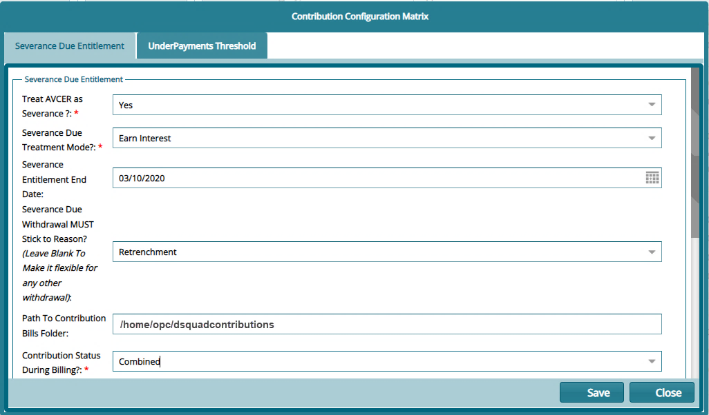

### Setting Contribution Config Matrix

This matrix addresses issues such as how to treat additional voluntary contributions by a member’s employer, severance, and contribution underpayments.

To set parameters for these items, locate the **Contribution Configuration Matrix** link from the drop-down submenu as shown below:

Clicking this link will open the Contribution Configuration Matrix dialog box where the **Severance Due Entitlement** parameters are configured as shown below:

 

Clicking the **UnderPayments Threshold** tab will allow configuration of details pertaining contribution under payments as shown below:

 
