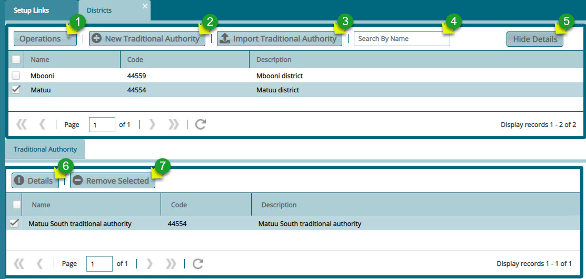

### District

FundMaster provides a window through which the details of districts covered by a scheme in terms of membership are captured as shown below:

  

**Action**

-   Click **label 1** menu button to display a drop-down list with links to create a new district, import districts in a template, viewing details of a selected district, or delete a selected district.

-   Click **label 2** button to create a traditional authority within a selected district.

-   Click **label 3** button to import, via a template, more than one traditional authority for a selected district.

-   Click **label 4** search box to type and search a district by name.

-   Click **label 5** button to hide or display the lower section of the window where traditional authorities in a district are listed.

-   Click **label 6** button to view the details of a selected traditional authority

-   Click **label 7** button to delete a selected traditional authority.