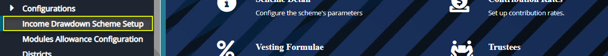
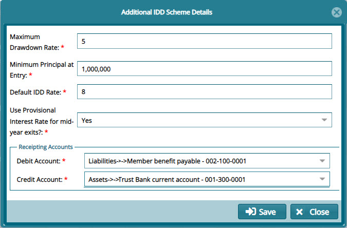

### Income Drawdown Scheme Setup

The set of configurations under the Income Drawdown Scheme Setup menu item, see the following screen shot, determine the payments made to a scheme member who opts for an income drawdown at the point of exiting a scheme.

  

Click the **Income Drawdown Scheme Setup** link to open a dialog box where the configurations are done as shown below:

  
