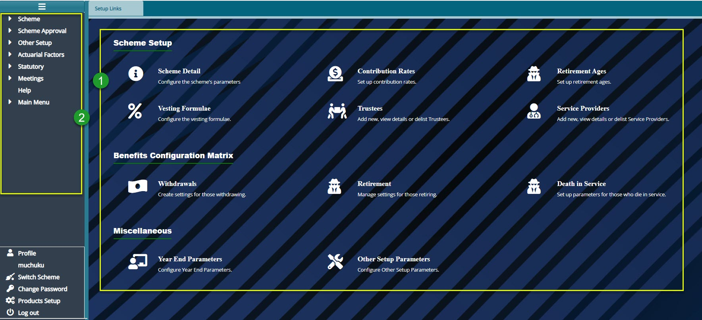
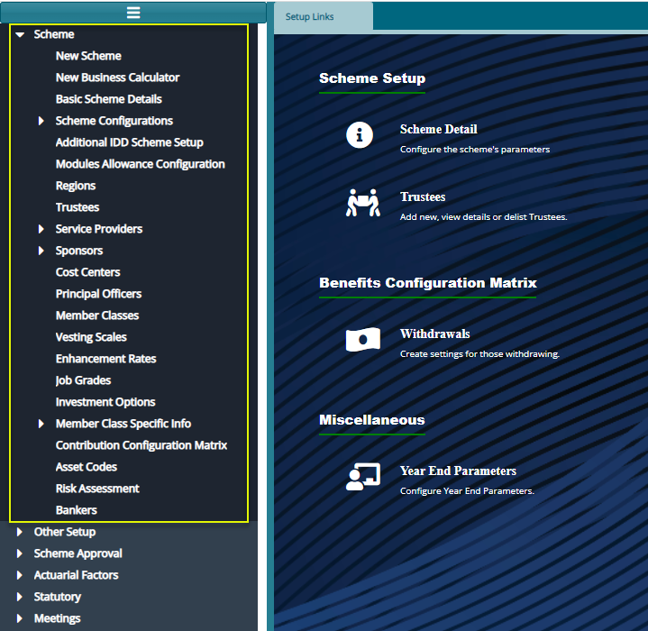

### Scheme Setup Module

The Scheme Setup module implements the trust deed and rules of a scheme. These
are implemented in the system through configurations such as Basic Scheme
Details, Contribution Rates, Vesting Scales, Schemes Member Classes, Reasons for
Exit, Interest Formula, Interest Rates, Benefits Configuration Matrix, End Year
Parameters, Pension Setup Parameters etc.

To access the Scheme Setup dashboard, click the **Scheme Setup** link on the
FundMaster landing page to open **Setup Links** Window as shown below:

  

**Action**

-   Click the links under the section **labeled 1** to configure Scheme Setup,
    Benefits Configuration Matrix, among other settings.

-   Click the menu items listed on the left side panel in section **labeled 2**
    to configure other Scheme Related settings such as Scheme Approval.

**Tip**

All the links under label 1 can still be accessed on the left side panel
although some are tacked under sub menus.

### Scheme Configurations Panel

Access more scheme configuration links from the left side panel of the **Setup
Links** Window as shown below.

Note that the links are arranged into categories making the order of
configurations convenient as shown below:

  

**Action**

-   Click a link under section **labeled 1** to open a window via which
    specific new scheme setting can be configured.

-   Click a link under section **labeled 2** to open a window via which a
    new *scheme service provider* details can be captured.

-   Click a link under section **labeled 3** to open a window via which
    *scheme sponsors* and sponsor related information can be captured.

-   Clicking a link under section **labeled 4** will open a window via which
    a *scheme members* related information e.g., *member classes* can be created.

-   Clicking a link under section **labeled 5** will open a window via which
    *other scheme* setting can be configured.