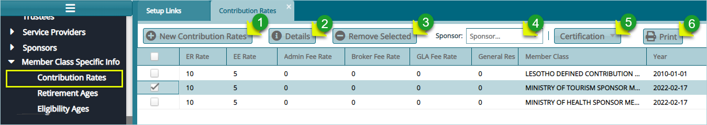

## Member Class Configurations

Configurations under **Member Class Specific Info** category inform how members of a particular class in a scheme are to
be handled apart from those of other classes within the same scheme in the case of defining contributions rates, retirement age and eligible age.

To configure these settings, on the scheme setup left side menu panel, locate
the access links as shown below:

 

## Contribution Rates

To set contribution rates, click the **Contribution Rates** link and then click
the **New Contribution Rates** button to add a new rate as shown below:

 

**Action**

-   Click **label 1** button to load a dialogue box and set new configuration

-   Click **label 2** button to view the details of a selected record on the
    list

-   Click **label 3** button to remove a selected configuration

-   Click **label 4** button to search records based on Sponsor

-   Click **label 5** button to Certify, Approve and Authorize a selected config
    record

-   Click **label 6** button to view a print format copy of the Contribution
    Rates details

Clicking the **New Contribution Rates** button labeled 1, will load a
**Contribution Rates** **Details** dialogue box through which a new Rate can be
configured as shown below:

 

**Tip**: notice the lower section of the dialogue box above. See how the new
Rates configurations are tied to a particular Member Class under a Sponsor.

## Retirement Age

Retirement Age configurations are set to categorize the different types of retirements. This determines the benefits of a retiree under each category during benefits processing.

Click the **Retirement Ages** link to open retirement ages window and view
already configured retirement ages, add a new configuration, delete and certify
selected records from the list as show below:

 

**Action**

-   Click **label 1** button to add a New Retirement Age configuration.

-   Click **label 2** button to view the details of a selected retirement
    record.

-   Click **label 3** button to delete a selected configuration from the
    records.

-   Click **label 4** button to Certify, Approve and Authorize a selected
    record.

Clicking the New Retirement Age button will open a dialogue box. Fill in the details to create a new retirement age as shown below:

 

## Eligible Ages

Eligibility age is a configuration set to determine who can be allowed in a
member class in terms of age limits.

 
