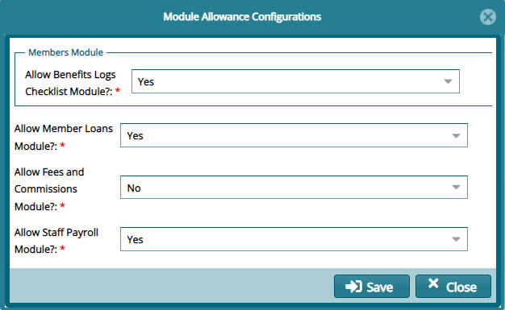

### Module Allowance Configurations

The set of configurations under the **Module Allowance Configuration** menu item, see the following screen shot, determine whether a scheme is allowed access to some extra modules.

  

Click the **Module Allowance Configuration** link to open a dialog box where the configurations are done as shown below:

  
