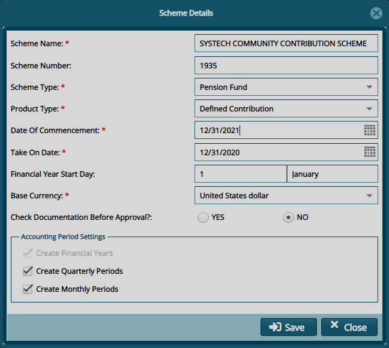

### Creating a New Scheme

To create a new scheme, click the **New Scheme** link to load a **Scheme Details** dialogue box where critical configurations such as scheme type, date of commencement, take on date and financial year are configured
as shown below:

  

**Tips**

The **Take On Date** is configured to determine the financial periods while the **Date of Commencement** denotes the start of the scheme.