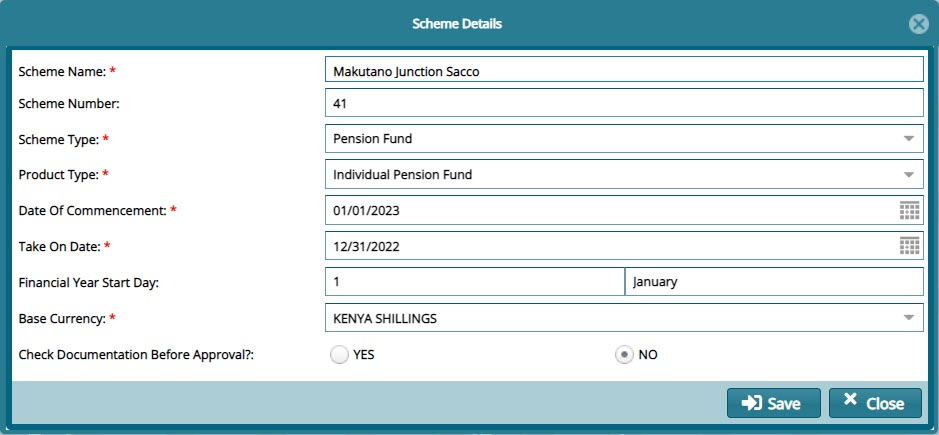

## New Scheme

To create a new scheme, click the **New Scheme** link to open a **Scheme Details** dialogue box where a set of configurations such as Scheme Type, Date of Commencement, Take on Date and Financial Years are done as shown below:
 
 

**Tip**

- The **Take On Date** is configured to determine the Financial Periods while the **Date of Commencement** denotes the date when the Scheme was started.