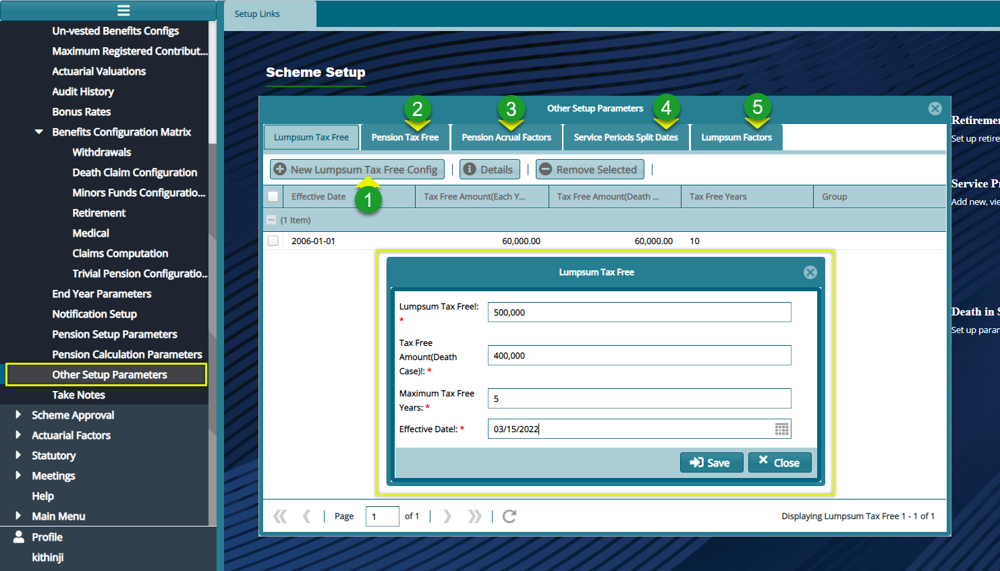

### Other Pension Parameters

Click the **Other Pension Parameters** link to open a dialog window and set the configurations for Lumpsum Tax Free and other related items as shown the screenshot below:

  

**Action**

- 	Click **label 1** button to load a dialogue box and set a new **Lumpsum Tax Free** configuration as shown above.
-	Click **label 2** button to open a dialogue box and set a new **Pension Tax Free** configuration.
-	Click **label 3** button to open a dialogue box and set a new **Pension Acrual Factor** configuration.
-	Click **label 4** button to open a dialogue box and set a new **Pension Service Periods** Split Dates configuration.
-	Click **label 5** button to open a dialogue box and set a new **Lumpsum Tax Free** configuration.
