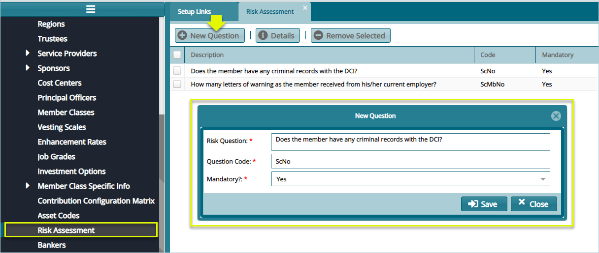

### Risk Assessment

This tool aids in setting scheme risk assessment questions. Feedback from the questions is used in a risk analysis process to check the validity of new members joining a scheme. Click the **Risk Assessment** link to open the risk assessment window, then click the **New Question** button to type a new question and save it as shown below:

 

