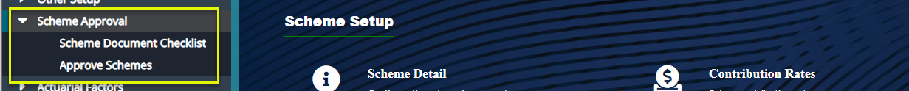
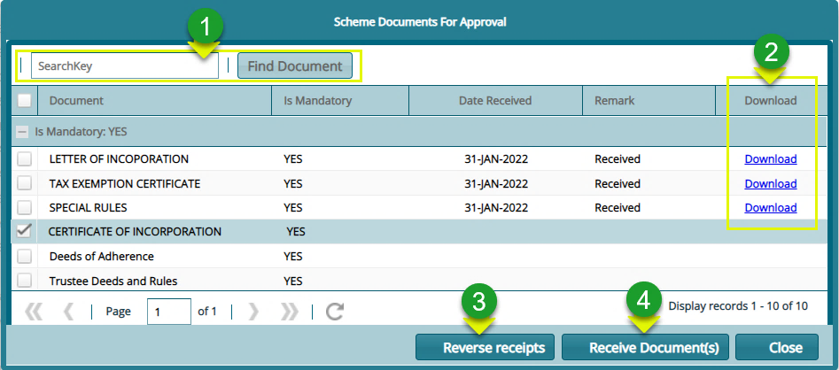
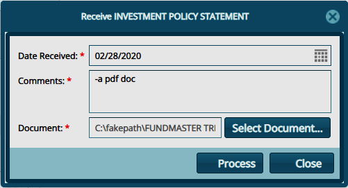

## Approving a Scheme

After a scheme is created, the next step is to approve it by first providing a checklist for necessary documents and then approving the scheme. From the Setup Links left side panel, click the appropriate link as shown below:

  

## Scheme Documents Checklist

Click the **Scheme Documents Checklist** link to open the window through which the management of such document is done as shown below:

 

**Action**

-   Click **label 1** button to create a new document checklist.

-   Click **label 2** button to view details of a selected document from the list.

-   Click **label 3** button to delete a selected document item from the list.
  

## Scheme Approval

Clink the **Scheme Approval** link to open the window through which the verification and certification of the scheme is done among other actions as shown below:

  

**Action**

-   Click **label 1** button to validate checklist of a selected scheme from the list.

-   Click **label 2** button to open a drop-down list to certify and approve a selected scheme.

-   Click **label 3** button to initiate the scheme cloning process. This allows the adoption of configurations from another scheme.

-   Click **label 4** search box to search and filter a scheme from the list by name.

-   Click **label 5** search box to filter schemes from the list as approved or not approved.

-   Click **label 6** button to initiate risk assessment process for a selected scheme.

-   Click **label 7** button and select a process from the drop-down list to view a report in print format.
  

Clicking the **Checklist Validation** button will open a **Schemes Document Approval** dialog box where documents can be searched from the list, received, and downloaded as shown below:

  

**Action**

-   Click **label 1** button to type a key word to search for a document from the list.

-   Click **label 2** text links to download a document that has already been received.

-   Click **label 3** button to reverse a received document.

-   Click **label 4** button to upload a document into the system.
  

Clicking the **Receive Documents(s)** button will allow a user to upload a file from his/her device through the dialog box shown below:

  
