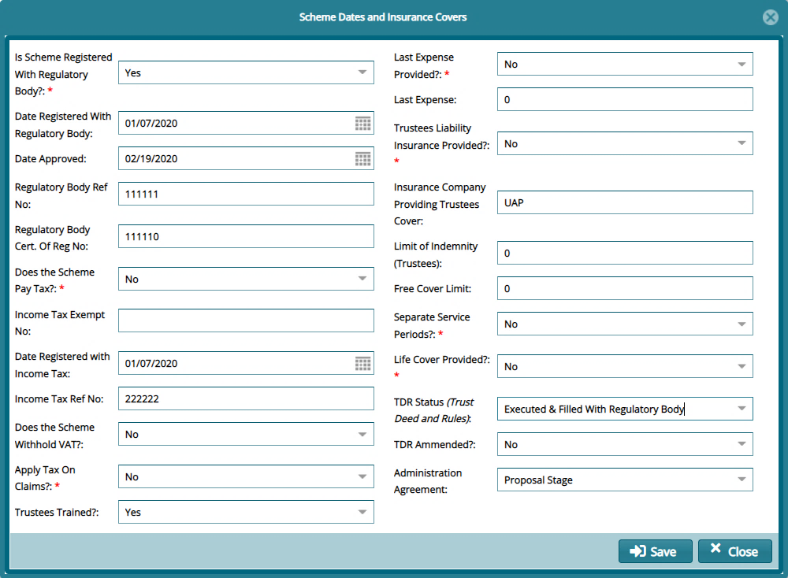
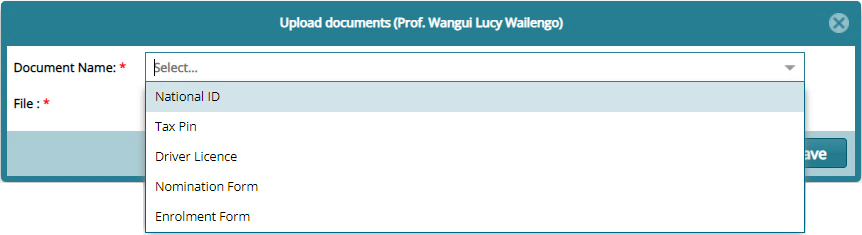
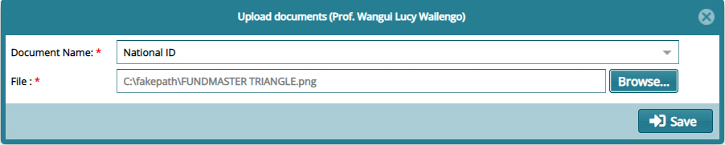

## Basic Setup Links

The Scheme Setup Module in FundMaster provides the tools necessary to set up a
new scheme and configure various parameters as stipulated in trust deeds and
rules. See screenshot below:

  

## Creating a New Scheme

To create a new scheme, click the **New Scheme** link to load a **Scheme
Details** dialogue box where critical configurations such as scheme type,
date of commencement, take on date** and financial year are configured
as shown below:

  

**Tips**

The **Take On Date** is configured to determine the financial periods while the
**Date of Commencement** denotes the start of the scheme.

## Scheme Switching Process

After successfully creating a new scheme, the next step is to make it - the
newly created scheme - the **Working Scheme** This is done by switching from the
current scheme to the new scheme in order to continue setting up other
configurations for the new scheme.

To switch schemes, first navigate back to the **Admin Panel** **links** window
and click **Existing Users** as shown in the following screenshot:

  

Clicking this link will open the Existing Users window displaying a grid table
listing all system users.

Select the current user in the table and click the **Details** button as shown
below:

  

Clicking the Details button will open the User Details window which shows
**Allowed Schemes**, **Sponsors** and **MemberClasses**. Click the Allowed
Schemes tab and assign Scheme to User as shown below:

  

**Action**

-   Click button **labeled 1** to open a window listing all available schemes
    from which new schemes can be selected and added to a user’s Allowed Scheme.

-   Click button **labeled 2** to open a window listing all available schemes
    from which new schemes can be added to the profile category that this user
    belongs to.

-   Click button **labeled 3** to remove a select record from a user’s assigned
    schemes.

Clicking the **Assign Schemes to User button** will open another window from
which you can select the scheme(s) to allow a user access to as shown below:

  

**Action**

-   Click the **checkboxe**s to select the Schemes to be allowed for the user.
    Then click the button on the upper right side of the window to display a
    drop-down menu and click the Allow Selected Schemes button to commit the
    changes.

-   Otherwise, if the user need access to all available schemes, then select the
    **Allow All Schemes** in the drop-down list as shown above.

-   Find a Scheme quickly from the list by typing a name on the **Search By Name
    box**; select the Plan Type from the drop down menu and click the Filter
    button.

**Tip**

The process of switching from a default scheme to a new scheme involves first
navigating to the **Existing Users** window in the Admin Panel and adding the
newly created scheme from the list of Allowed Schemes.

## Working Scheme

After assigning the new scheme to the current user account, navigate to
the landing page and on the left side panel and make it the **Working Scheme** by clicking the **Switch Scheme** button
as shown below:

  

Clicking this button will open a new window displaying all the available schemes
the user can switch to.

  

**Action**

-   Click **label 1** search box and type to search a scheme by name

-   Click **label 2** drop-down box to select an option to search for scheme
    records based on plan type

-   Click **label 3** to filter records based on search name or plan type

-   Click **label 4** to set a selected scheme from the list as the working
    Scheme.

## Basic Scheme Details

Now that the system is running the new scheme, the next step is to provide the
scheme’s details beginning with the basic detail.

To access the details dialogue box, from the left side panel of the Setup Links
window, click the **Basic Schemes Details** link. This will launch a dialogue
box where all the details can be viewed and edited as shown below.

Note: If you modify any items, remember to click the Save button to reflect
changes as shown below:

 

## Additional Scheme Info Setup

This is another set of particulars of the scheme. Parameter to inform
**contributions and interest calculations** are configured here. Click the
**Additional Schemes Info Setup** link, as shown previously, to launch the
dialogue box as shown in the next screenshot.

Fill in the provided fields paying attention to the mandatory fields which
should be filled appropriately for a successful setup.

  

**Tip**

The terms used on the additional basic scheme details dialog box are defined in
the glossary section of this user manual. Please refer for clarification.

## Additional Scheme Info

The parameter set here include those that determine payment rules and process.
For configurations, click the **Other Scheme Details** link on the left side
panel to load a dialogue box.

Fill in the provided fields, paying attention to the mandatory fields (marked in
red asterisk) which should be filled appropriately as shown below:

  

## Module Allowance Configurations

These set of configurations will determine the scheme setup module integration
with other modules in the system. Click the **Module Allowance Configuration**
link from the left side panel to open and fill the dialogue box shown below:

  

## Dates & Insurance Cover

This configuration enables a scheme crucial date such as registration dates with
regulatory bodies, insurance companies and related details to be set.

click the **Scheme Dates and Insurance Cover** link to load the dialogue box
shown below for configurations:

  

## Regions

Region configs capture details for different physical locations which a scheme
entity covers in terms of membership. FundMaster offers a tool for configuring
location details as shown below:

  

**Action**

-   Click **label 1** button to display a drop-down list where links to trigger
    the processes of creating a new region, viewing details of a selected
    region, or deleting one from the list are located.

-   Click **label 2** search box to type and search a region by name.

-   Click **label 3** button to hide or display the lower section of the window
    where sub regions are listed.

-   Click **label 4** search box to type and search a sub region by name.

## Trustees

Trustees configs allow a scheme to have its trustees’ details and their relevant
support documents captured in the system for referencing.

To manage the trustees, click the **Trustees** link to open the Trustees Window
as shown below:

  

**Action**

-   Click **label 1** button to capture a new trustee’s details

-   Click **label 2** to view the details of a trustee selected from the list

-   Click **label 3** to delete selected trustees from the list

-   Click **label 4** to upload support documents for a selected trustee

-   Click **label 4** to view documents for a selected trustee

Clicking the **Upload Document** button will open an upload window for selecting
the type of document to upload to the system as shown below:

  

After selecting the type of document to upload, click the browse button to give
a path for uploading a document from your device as shown below:

  

The window below shows the uploaded document. All uploaded documents will be
listed here.

  
