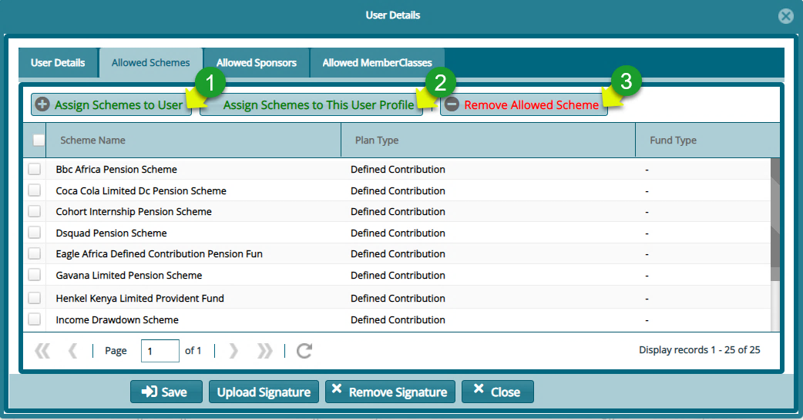
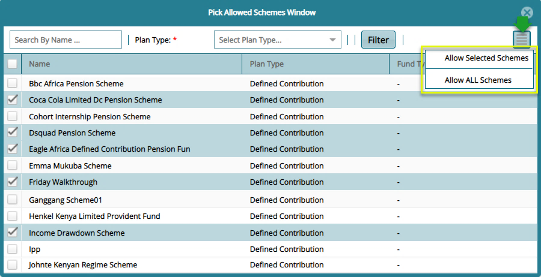
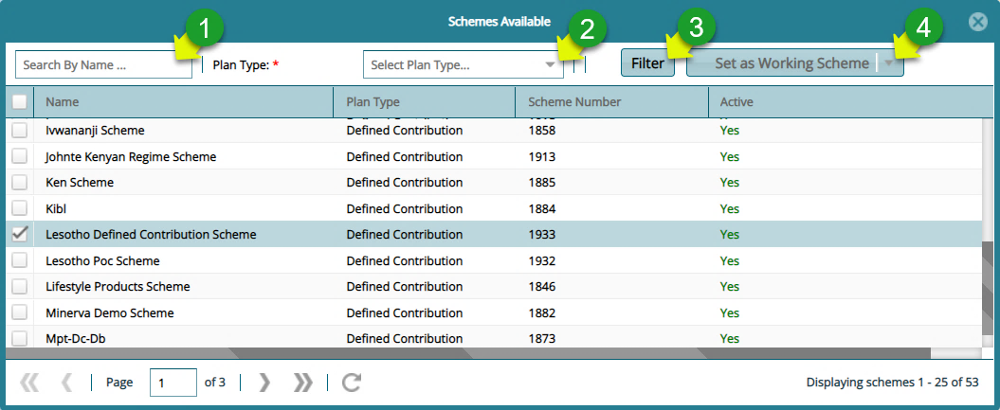

## Scheme Switching Process

After successfully approving a newly created scheme, the next step is to make it the **Working Scheme**. This is done by switching from the current scheme to the new scheme in order to continue setting up other configurations for the new scheme.

To switch schemes, first navigate back to the **Admin Panel** links window and click **Existing Users** as shown in the following screenshot:

Clicking this link will open the Exiting Users window displaying a grid table listing all system users. Select the current user in the table and click the **Details** button as shown below:

  

Clicking the Details button will open the User Details window which shows **Allowed Schemes**, **Sponsors** and **MemberClasses**. Click the Allowed Schemes tab and assign Scheme(s) to User as shown below:

 

**Action**

-   Click button **labelled 1** to open a window listing all available schemes from which new schemes can be selected and added to a user’s Allowed Scheme.

-   Click button **labelled 2** to open a window listing all available schemes from which new schemes can be added to the profile category that this user belongs to.

-   Click button **labelled 3** to remove a select record from a user’s assigned schemes.
  

Clicking the **Assign Schemes to User button** will open another window from which a scheme(s) to allow can be selected as shown below:

 

**Action**

-   Click the **checkboxes** to select the Schemes to be allowed for the user. Then click the button on the upper right side of the window to display a drop-down menu and click the Allow Selected Schemes button to commit the changes.

-   Otherwise, if the user need access to all available schemes, then select the **Allow All Schemes** in the drop-down list as shown above.

-   Find a Scheme quickly from the list by typing a name on the **Search By Name box**; select the Plan Type from the drop down menu and click the Filter button.
  

**Tip**

The process of switching from a default scheme to a new scheme involves first navigating to the **Existing Users** window in the Admin Panel and adding the newly created scheme from the list of Allowed Schemes.

### Scheme Switch Over

After assigning scheme the new scheme to the current user account, navigate to the landing page and on the left side panel, click the **Switch Scheme** button as shown below:

  

Clicking this button will open a new window displaying all the available schemes the user can switch to as shown below:

  

**Action**

-   Click **label 1** search box and type to search a scheme by name.

-   Click **label 2** drop-down box to select an option to search for scheme records based on plan type.

-   Click **label 3** to filter records based on search name or plan type.

-   Click **label 4** to set a selected scheme from the list as the working Scheme.