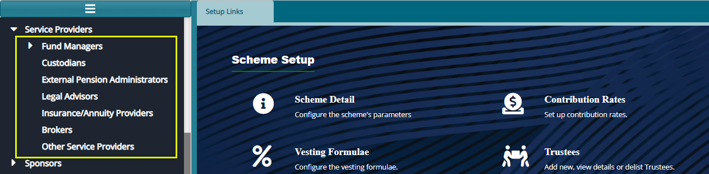
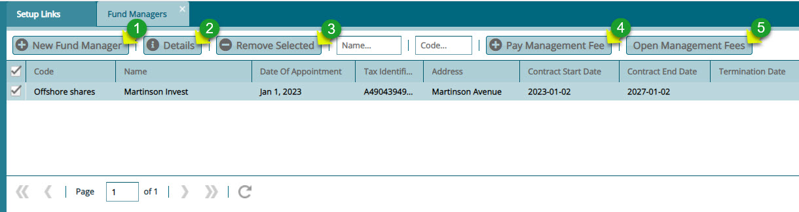
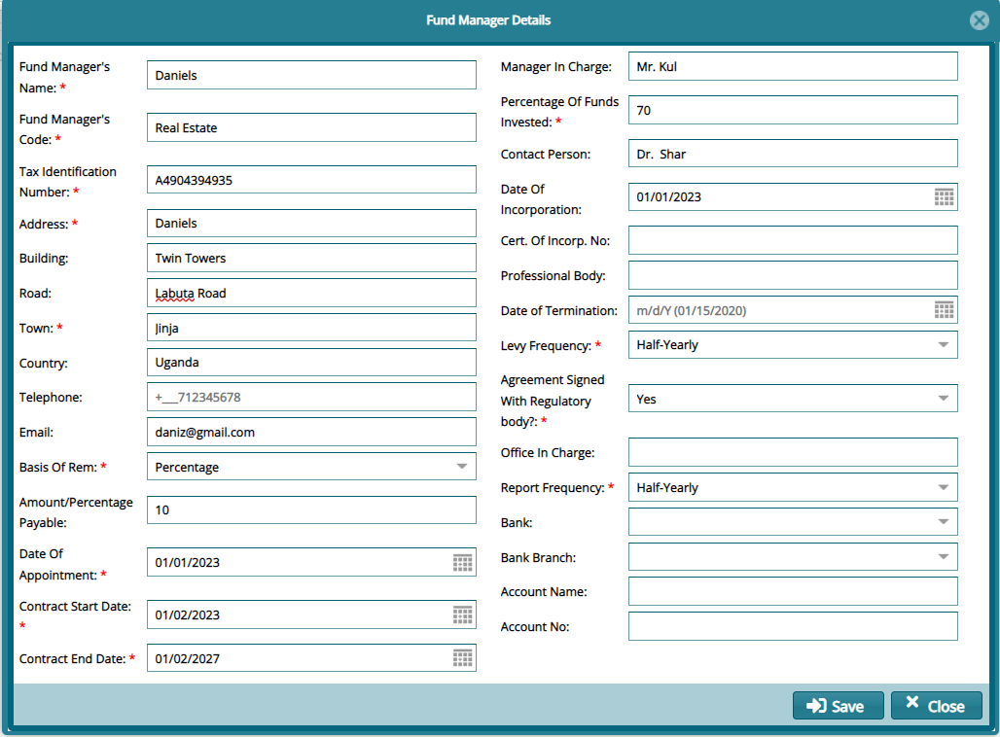
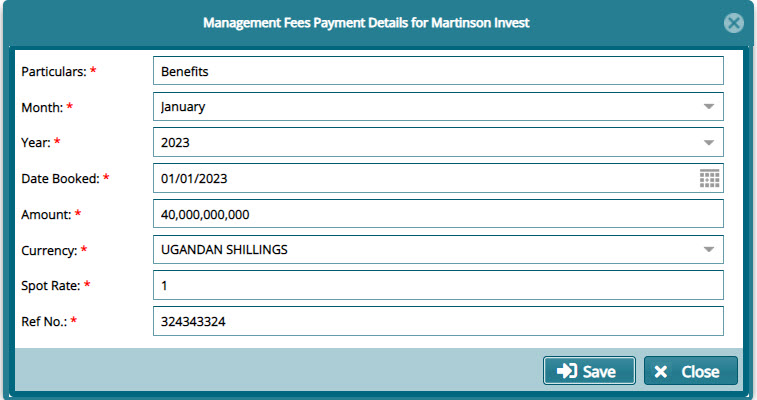
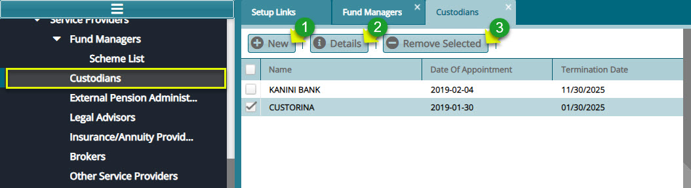
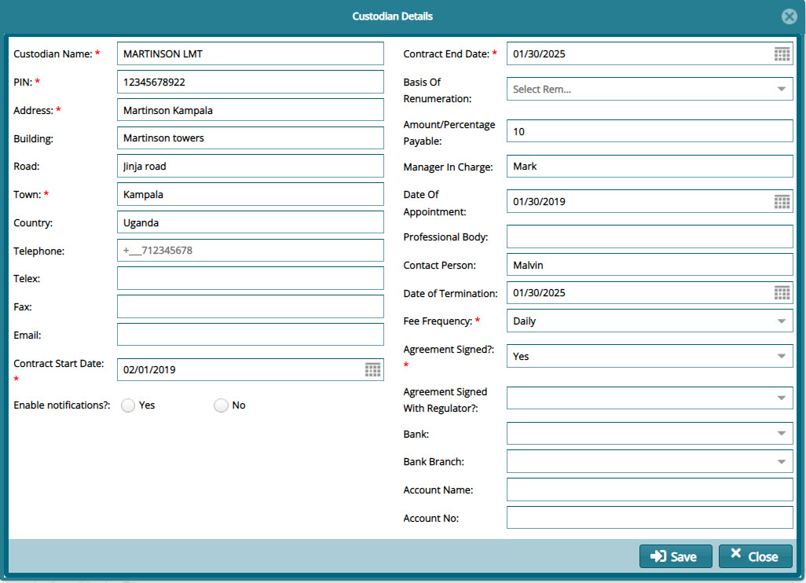
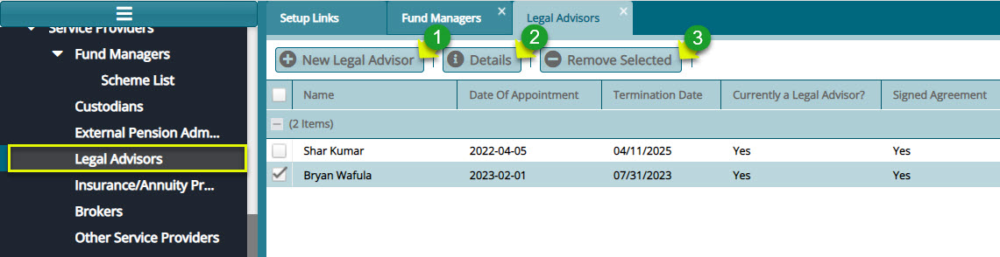
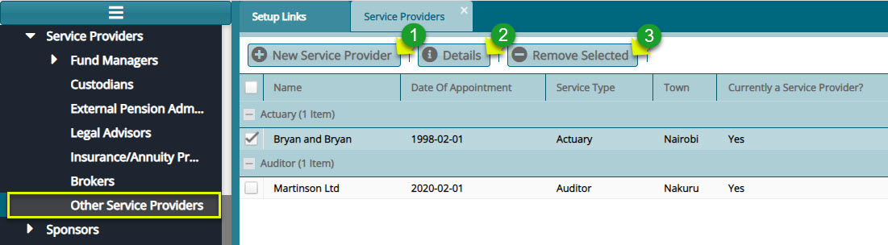

### Service Providers

The links under service providers drop-down menu aid in capturing and managing a scheme's various service prover details. The screenshot below shows a drop-down menu with links to various configurations windows:

  

## Fund Managers

FundMaster provides a window through which the details of contracted scheme fund managers are captured as shown below:

  

**Action**

-   Click **label 1** button to capture the details of a fund manager.

-   Click **label 2** to view the details of a selected fund manager from the list.

-   Click **label 3** to delete a selected fund manager from the list.

-   Click **label 4** to load a dialog box for capturing payment details.

-   Click **label 5** to view management fee details.
  

Clicking the **New Fund Manager** button, as shown in the previous screenshot, will load a dialog box for capturing the details of a new Fund Manager as shown below:

  

Clicking the **Pay Management Fee** button, as shown in the previous screenshot, will load a dialog box for capturing the payment details as shown below:

  

## Custodians

FundMaster provides a window through which the details of contracted scheme custodians are captured as shown below:

  

**Action**

-   Click **label 1** button to capture the details of a new custodian.

-   Click **label 2** to view the details of a selected custodian from the list.

-   Click **label 3** to delete selected a selected custodian from the list.
  

Click the **New** button, as shown in the previous screenshot, to load a dialog box for capturing the details of a new custodian as shown below:

  

## External Pension Admins

External Pension Administrators form aid in capturing external pension admins' details. Click the **External Pension Administrators** link to open the **Transfer Out Scheme** window displaying a list of external schemes details in a grid table. 

Click the **New** button to open a dialog box and capture new external scheme details in the system as
shown in the screenshot below:

  

## Legal Advisors

FundMaster provides a window through which the details of contracted scheme Legal Advisors are captured as shown below:

  

**Action**

-   Click **label 1** button to capture the details of a new legal advisor.

-   Click **label 2** to view the details of a selected legal advisor from the list.

-   Click **label 3** to delete selected a selected legal advisor from the list.

## Insurance/Annuity Providers

Insurance/Annuity Providers form aid in capturing details for the insurance and annuity providers with whom a scheme works in partnership.

Click the **Insurance/Annuity Providers** link to open the Transfer Out Scheme window displaying a list of Annuity Providers in a grid table.

Click the **New** button to open a dialog box and capture a new annuity provider details in the system as shown in the screenshot below:

  

## Brokers

Brokers configurations form aid in capturing details for various brokers with whom a Scheme works in partnership.

Click the **Brokers** link to open the Brokers window displaying a list of brokers' details in a grid table as shown below:

  

Click the **New Broker** button to open a dialog box and capture a new broker's details in the system as shown in the screenshot below:

  

## Other Service Providers

FundMaster provides a window through which the details of contracted scheme Legal Advisors are captured as shown below:

  

**Action**

-   Click **label 1** button to capture the details of a new service provider.

-   Click **label 2** to view the details of a selected legal service provider from the list.

-   Click **label 3** to delete selected a selected service provider from the list.
