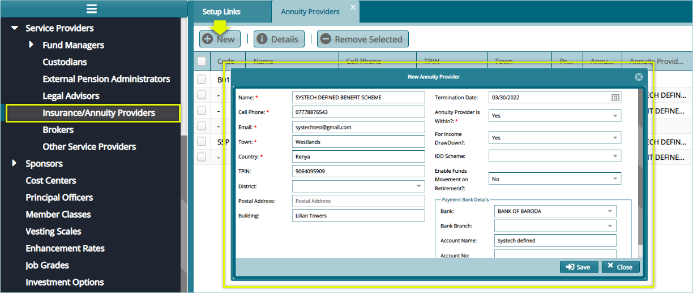

## Service Providers configs

Configurations under Service Providers aid in capturing and managing a scheme’s various service prover details. The screenshot below shows a section of the sidebar panel where links to various configurations are located.

  

## External Pension Administrators

External Pension Administrators configurations aid in capturing external pension admins’ details.

Clicking the **External Pension Administrators** link will open the Transfer Out Scheme window displaying a list of external schemes details in a grid table. Click the **New** button to open a dialogue box and capture new external scheme details in the system as shown in the screenshot below:

  

## Insurance/Annuity Providers

Insurance/Annuity Providers configs aid in capturing details for the Insurance and Annuity Providers that a Scheme works in partnership with.

Clicking the **Insurance/Annuity Providers** link will open the **Transfer Out Scheme** window displaying a list of Annuity Providers in a grid table. Click the **New** button to open a dialogue box and capture a new Annuity Provider details in the system as shown in the screenshot below:

  

## Brokers

Brokers configs aid in capturing details for various brokers that a Scheme works in partnership with.

Clicking the **Brokers** link will open the Brokers window displaying a list of brokers' details in a grid table as shown below:

  

Click the **New Broker** button to open a dialogue box and capture a new Broker’s details in the system as shown in the screenshot below:

  
