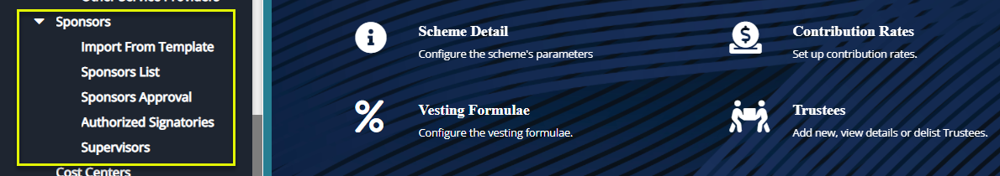
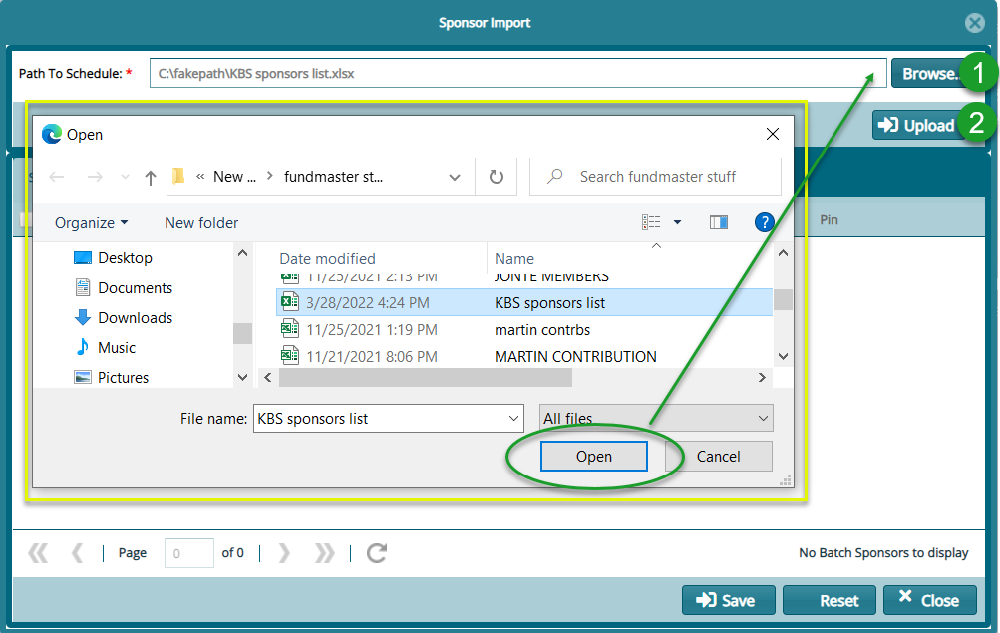
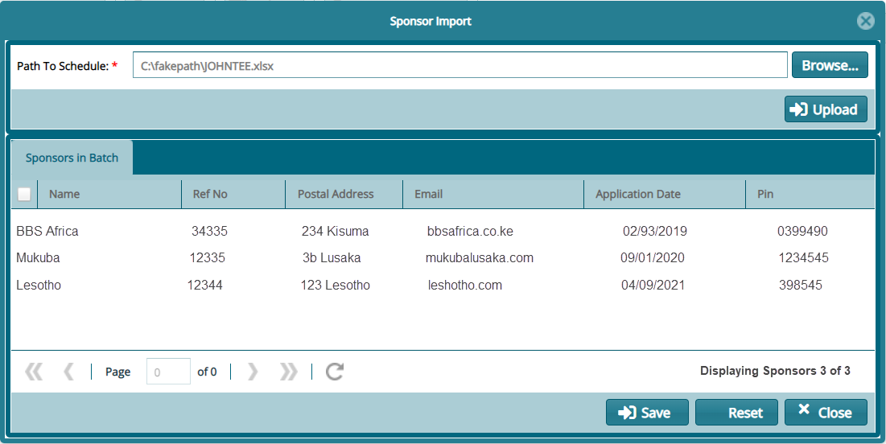
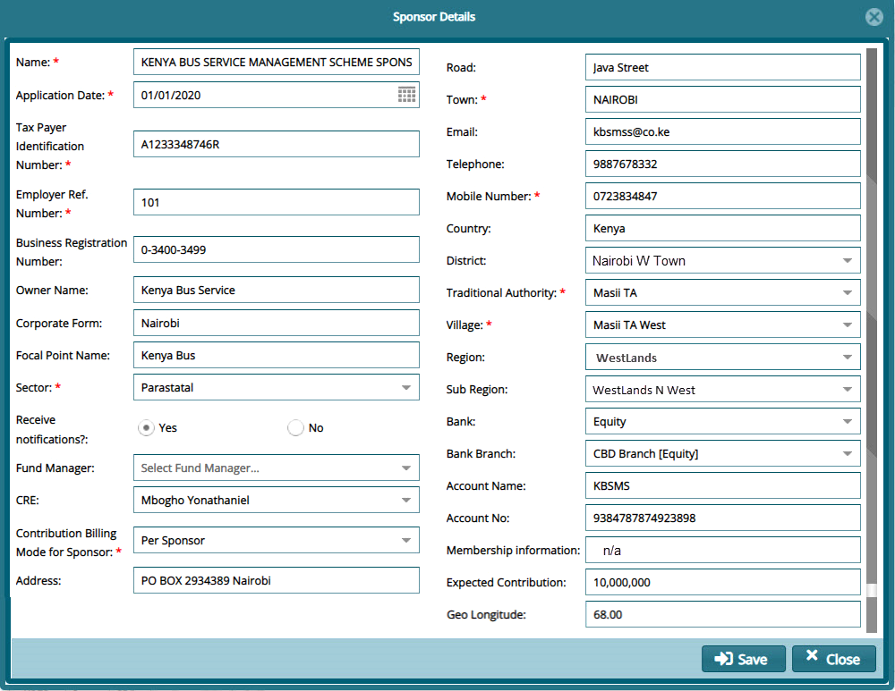
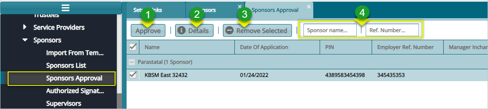
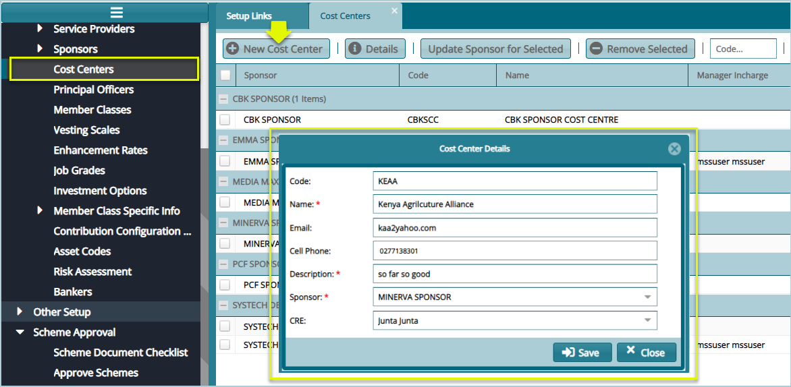
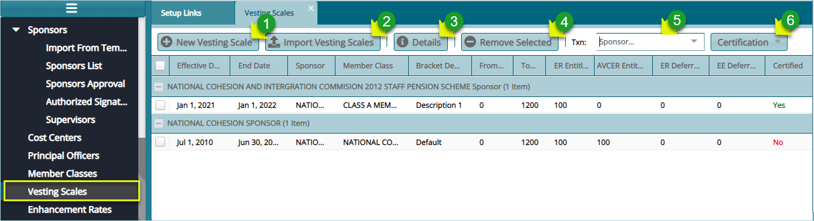
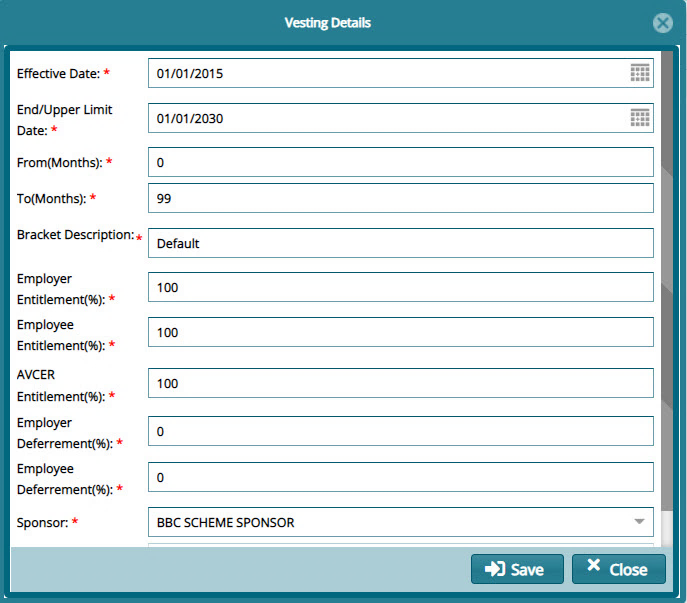

## Sponsor Creation Process

The word Sponsor is used in FundMaster to denote an employer (in a scheme where employers make contributions on behalf of their employees (members)). Providing sponsor details in a scheme is key - the following section demonstrates how this can be achieved in the system. Locate the Sponsors sub-menu from the scheme setup window’s left sidebar panel as shown below:

 

## Importing Sponsors from a Template

Click the **Import From Template** link to upload sponsors in batch using a template as shown in the screenshot below:

 

**Action**

- Click **label 1** button to locate where the sponsors template is stored in your device as shown in the screenshot above.
  
- Click **label 2** button to pull the sponsors details from the template to the system as shown in the following screenshot.
  

A successful batch upload of sponsors from a template will result in a display of all uploaded sponsors details in a grid table as shown below:

 

## Sponsors List

Clicking the **Sponsors List** will open the sponsor’s window where sponsors’ records are displayed on a grid table. 

Click **New Sponsor** button to add a new employer, click the **Details** button to see the all the details of a selected sponsor on the list, and the Merge Selected to combine two or more sponsors into one. Finally, you can filter records by name, reference number, or by scheme as shown below:

 

## New Sponsor

Clicking the **New Sponsor** button will load a Sponsor Details dialogue box through which the employer’s data is captured into the system as shown below:

 

## Sponsor Approval

After creating a Sponsor, the next step before the sponsor can officially be put on the register, is to approve them. To approve a sponsor, Click the **Sponsors Approval** link to open the Approval window as shown below:

 

**Action**

-   Click **label 1** button to Approve a selected sponsor from the list.

-   Click **label 2** button to view details of a selected sponsor.

-   Click **label 3** button to remove a selected sponsor from the list.

-   Click **label 4** textboxes, type a name or reference number to search records.

## Supervisors

Supervisor set of configurations aid in capturing supervisors' details for effective management of a various activities of a scheme.

Click the **Supervisors** link to open the Supervisors window where all the supervisors in a scheme are listed in a grid table. From the **Operations** button, you can add, remove, or view details of a supervisor. See screenshot below:

Supervisor’ set of configurations aid in capturing supervisors’ details for effective management of various activities of a scheme.

Click the **Supervisors** link to open the Supervisors window where all the supervisors in a scheme are listed. From the **Operations** drop-down menu, click to **Add**, **Remove**, and **View** the details of a supervisor as shown in the screenshot below:

 

## Cost Centers

Cost Centers are created to aid in the management of sponsors in a scheme with more than one sponsors – these types of schemes are known as umbrella schemes. 

To create a new cost center, click the **Cost Center** link to open the Cost Center window and then click the **New Cost Center** to create a new center as shown below:

 

## Principal Officers

Principal Officer’s set of configurations aid in capturing schemes’ principal officers’ details for effective management of various activities.

Click the **Principal Officer** link to open the Principal Officers window which displays a list of officers’ details in a grid table. Click the **New Principal Officer** button to open a dialog box and capture a new officer’s details in the system as shown in the screenshot below:

 

## Member Classes

Member Classes are created to aid in the managementr of members in a scheme where a sponsor has different categories of members either because they span geographic locations, branches, job grades (with different contribution rates) or any other form of categorization. 

Click the **Member Classes** link to open the Member Classes window where a list of sponsors and their member classes are listed in a grid table. To create a new member class, click the **New Member Class** button to open a Member Class Details dialog box for capturing a new member class details as shown in the screenshot below:

 

## Vesting Scales

In the event an employee resigns, the vesting scales configurations will aid in determining the employer and employee entitlement and deferment of some amounts based on the regime, legislation towards calculating a member’s benefits among other factors.

Click the **Vesting Scales** link to open the Vesting Scales Window where different vesting configurations are listed as shown below:

 

**Action**

-   Click **label 1** button to create a New Vesting Scale.

-   Click **label 2** button to import vesting configurations from a template.

-   Click **label 3** button to view details of a selected configuration from the records.

-   Click **label 4** button to remove a selected vesting configuration.

-   Click **label 5** button to search config records based on Sponsor.

-   Click **label 6** button to Certify, Approve and Authorize a selected config record.
  

To create a new vesting scale, click the **New Vesting Scale** button to load a dialog box through which a new configuration can be set. Fill the dialog box with appropriate details as shown below:

 
