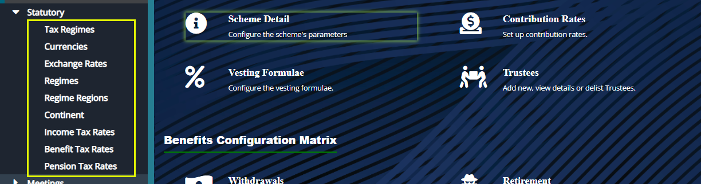
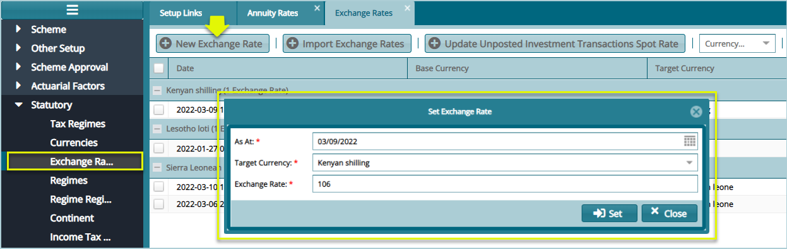
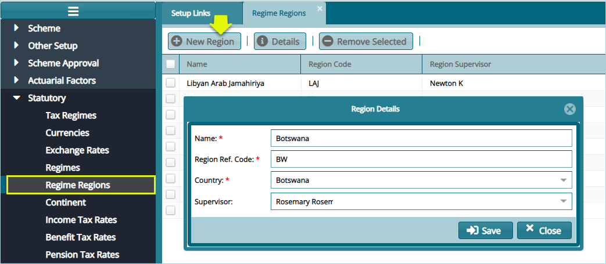
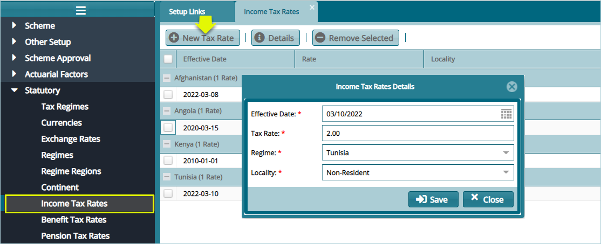
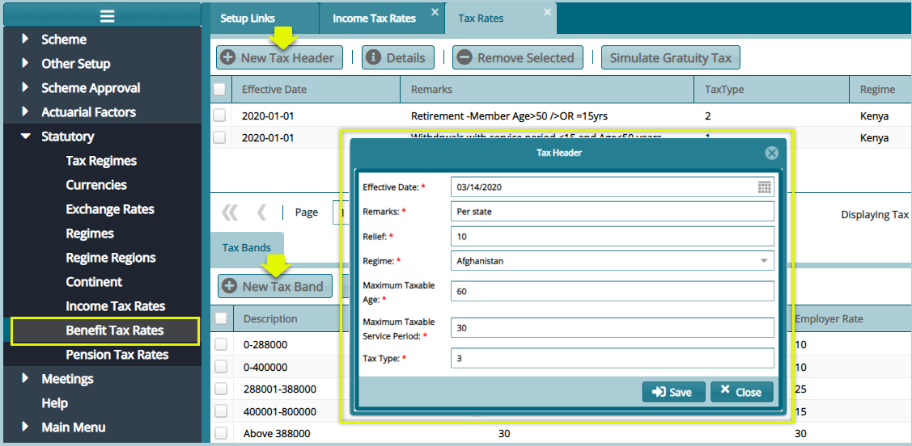

## Statutory settings

Statutory configurations are tax rates that affect the retirement benefits processes as defined by a regime’s commissioner of tax. The screenshot below shows the links through which different setups are done:

  

## Tax Regimes

Click the **Tax Regimes** link to open the Tax Regimes window, then click the **New Regime** button to add a new regime as shown below:

  

## Exchange Rates

Click the **Exchange Rates** link to open the Exchange Rates window, then click the **New Exchange Rate** button to add a new exchange rate configuration as shown below:

  

## Regimes

Click the **Regimes** link to open the Exchange Rates window, then click the **New Regime** button to create a new regime as shown below:

  

## Regimes Regions

Click the **Regimes Regions** to open the Regime Regions window, then click the **New Region** button to create a new region as shown below:

  

## Continent 
Click the **Continent** link to open the Continents Window, then click the **New Continents** button to add a new Continent as shown below:

  

## Income Tax Rates

Click the **Income Tax Rates** link to open the Income Tax Rates window, then click the **New Tax Rate button to define a new tax rate** as shown below:

  

## Benefits Tax Rates

Click the **Benefits Tax Rates** link to open the Tax Rates window, then click the **New Tax Header button** and the **New Tax Band** button to configure tax header and band respectively as shown in the following screenshot.

**Note:** the tax headers conditions and the tax headers are dictated by the commissioner of taxes in each regime.

  

**Note:** the tax headers conditions and the tax headers are dictated by the commissioner of taxes in each regime.

## Pension Tax Rates

Pension tax rates Configuration defines the pension tax free amount, personal relief amount. Selecting a new tax band will open a dialog box at the lower side of the window to aid in adding the pension tax bands as shown below:

  
