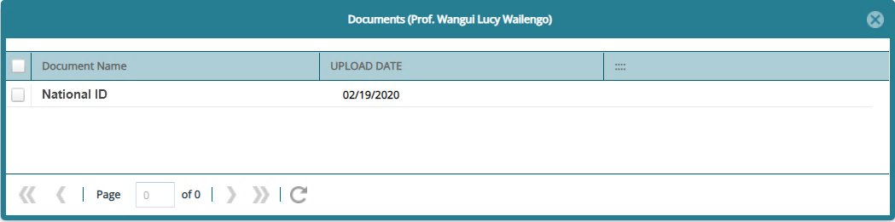

### Trustees

FundMaster provides a window through which the details of scheme trustees are captured. To manage the trustees, click the **Trustees** link to open the Trustees window as shown below:

  

**Action**

-   Click **label 1** button to capture a new trustee's details.

-   Click **label 2** to view the details of a trustee selected from the list.

-   Click **label 3** to delete selected trustees from the list.

-   Click **label 4** to upload support documents for a selected trustee.

-   Click **label 5** to view documents for a selected trustee.
  

Click the **Upload Document** button to open an upload window for selecting the type of document to upload to the system as shown below:

  

After selecting the type of document to upload, click the browse button to give a path for uploading a document from your device as shown below:

  

The window below shows a list of all uploaded documents.

  

