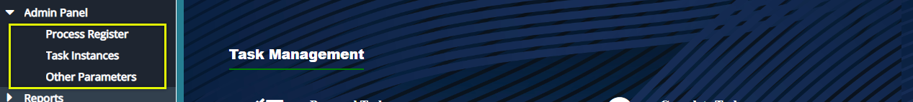
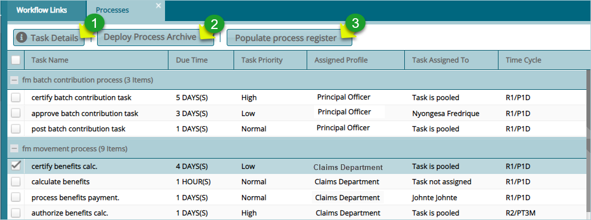
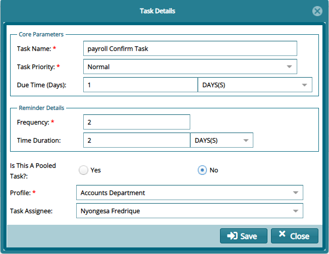
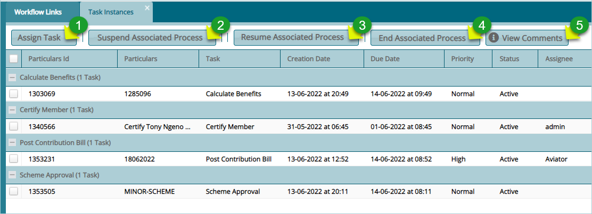
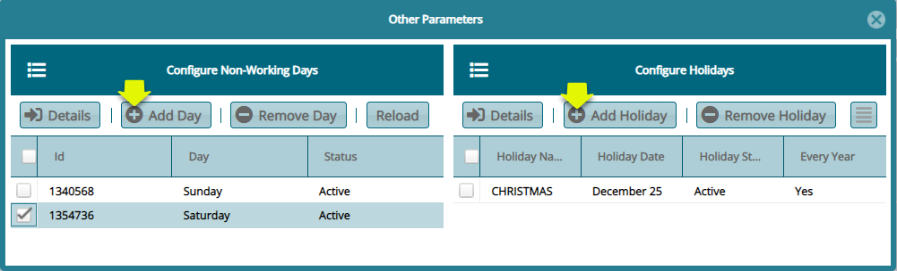
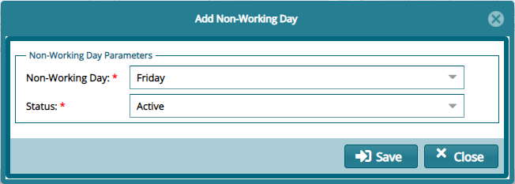
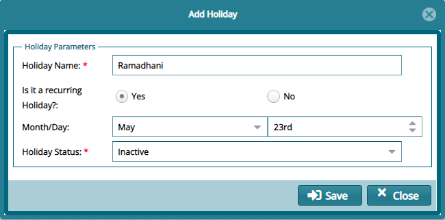

### Admin Panel

The access links under the Admin Panel menu allow viewing of a list of all processes categories and task instances and other parameters. Click the drop-down submenu links to open their respective windows as shown below: 

  

## Process Register

Clicking the **Process Register** link will open the Processes window where the details for all processes and their different tasks, assigned users and other details are displayed in a grid table as shown below:

  

**Action**

-   Click **Label 1** button to view the details of a selected task from the list and edit the details where necessary.

-   Click **Label 2** button to load process archive to the database ready for database update.

-   Click **Label 3** button to populate process register with new processes and tasks.

Clicking the **Task Details** button will open the task details dialog box where the details of a selected task from the list can be viewed and configured as shown below:

  

**Action**

The Task Details dialog box allows you to set the following parameters for each task

-   Priority of a task: choose between low, normal, or high.

-   Due time for the task: Choose minutes, hours, or days.

-   Task reminder: choose the frequency and time duration.

-   Determine whether the task is pooled or allocated to a selected user.

-   If the user is to be selected, choose the profile and the profile user to assign the task to.

## Task Instances

Clicking the **Task Instances** link will open the tasks instances window where new tasks and their details are listed for further actions such as assigning task to users. See screenshot below:

  

**Action**

-   Click **Label 1** button to assign a selected task to a user from a pool.

-   Click **Label 2** button to stop the process associated with a selected task.

-   Click **Label 3** button to start a stop process associated with a selected task.

-   Click **Label 4** button to terminate the process associated with a selected task.

-   Click **Label 5** button to view the open a comment dialog box of a selected task.

## Other Parameters

Clicking the **Other Parameters** link will open the other parameters window where non-working days and holidays are configured. This will enable the workflow schedular to omit these days in allocation of tasks to days.

To configure a non-working day, click the **Add Day** button to open a dialog box to set the day and Add Holiday button to set a day as holiday among other settings such as removing a set day as shown below:

 

To configure a non-working day, click the **Add Day** button will open a dialog box for setting up the day as shown below:

  

To configure a holiday, click the **Add Holiday** button will open a dialog box for setting up the day as shown below:

  