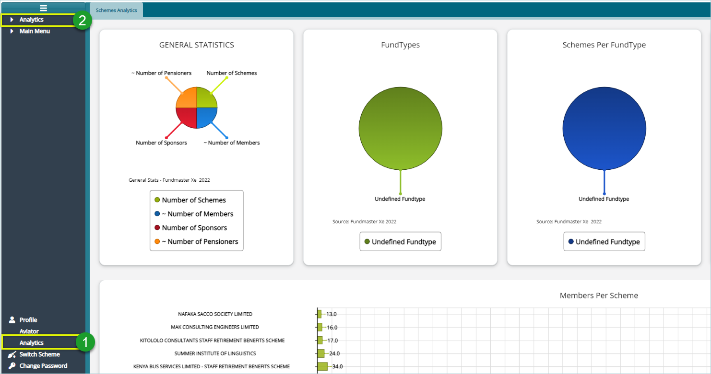
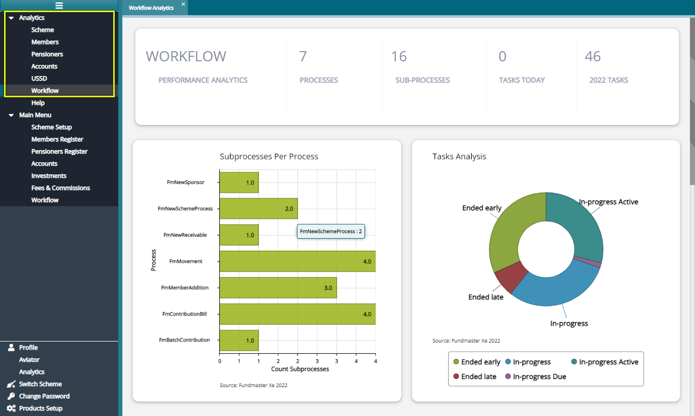

### Analytics

The scheme analytics window displays different types of analysis on various scheme processes. To open the scheme analytics window, click the analytics button labelled 1 as shown in the following screenshot:

  

**Action**

-   Click **Label 1** button to open the schemes analysis window as shown above.

-   Click **Label 2** button to reveal a drop-down list where links to access different analysis on the system modules are listed as shown in the following screenshot:

  