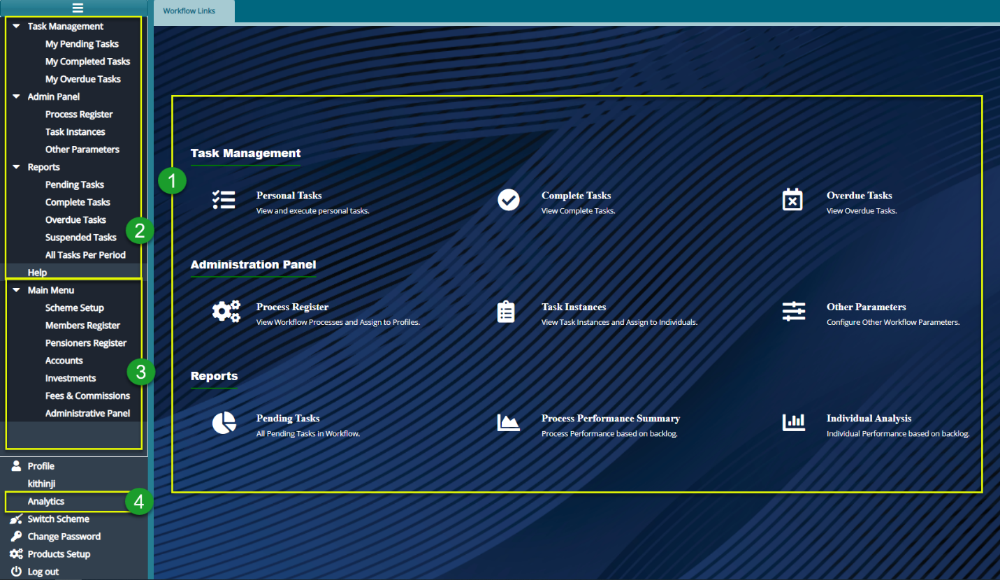
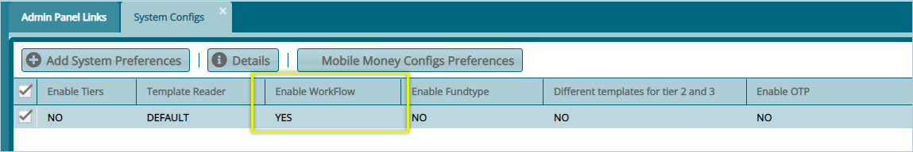

### Workflow Management Module

This workflow management module enables a work distribution system that automates all core processes such as claims, payroll processing, contribution, and member registration. By assigning tasks to different users, the module allows for step-by-step execution of tasks. One can map workflow processes, assign profile timelines, assign tasks, analyze complete, overdue, and pending tasks, view task instances and assign them to individuals, among other operations.

To access the investments Module dashboard, click the **Workflow Module** link on the FundMaster landing page to open **Workflow Links** window shown below:

  

**Action**

-   Click the hot links under the section **labelled** 1 to access shortcut routes to commonly visited links in the workflow management module.

-   Click the menu item links on the left side panel in section **labelled 2** to access all links for configuring all workflow related settings.

-   Click the menu item links in section **labelled 3** to navigate to other modules in the system.

-   Click the menu item link in section **labelled 4** to open the workflow analytics window to view analyzed data on all the workflow processes.
  

**Tips**

-   All the links under label 1 can still be accessed on the left side panel although some are tacked under sub menus.

-   Before proceeding with any workflow configurations, navigate to the Admin Panel links window and click the Systech configs link to open the System Configs window. Make sure **Enable Workflow** is **Yes**. If it is **No** click the **Details** button to open a dialog box where this is configured as shown in the screenshot below:

  