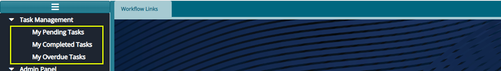
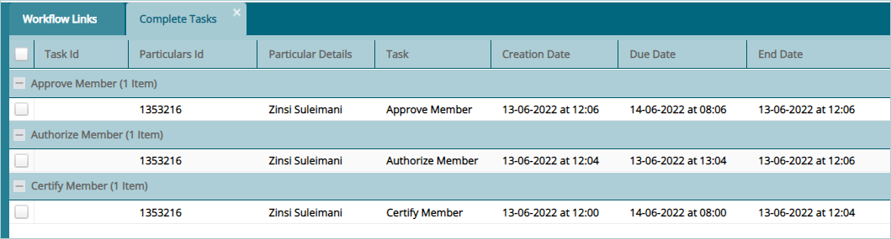
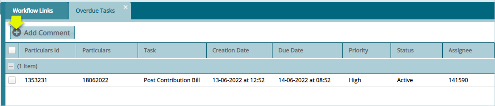

### Task Management

The links under the Task Management menu allow access to different task related windows for specific configurations. Click on the drop-down submenu links to open their respective windows as shown below: 

  

## My Pending Tasks

Clicking **My** **Pending Tasks** link will open the Personal Tasks window where the details for all tasks assigned to the current system user are listed as shown below:

  

## My Completed Tasks

Clicking **My Completed** **Tasks** link will open the Completed Tasks window where the details for all tasks assigned and already completed by the current system user are listed as shown below:

  

## My Overdue Tasks

Clicking **My Overdue** **Tasks** link will open the Overdue Tasks window where the uncompleted tasks assigned to the current user are listed as shown below:

  

Click the **Add Comment** button to write a comment in related to a selected task from the list.